# Course 4: Localization

## Lesson 1: Introduction to Localization

### 1.1 Localization in Robotics

**Overview:**

* **Definition:** Localization is the process of determining a robot’s position and orientation within a mapped environment.
* **Key Challenge:** It requires filtering noisy sensor measurements to accurately estimate the robot’s state.

**Example Provided:**

* A robot navigates a room by taking sensor measurements to identify its precise location.

**Popular Localization Algorithms:**

* **Extended Kalman Filter (EKF) Localization:**
  * Uses a Gaussian filter to estimate the state for non-linear models.
* **Markov Localization:**
  * Maintains a probability distribution over all possible positions and orientations.
* **Grid Localization (Histogram Filter):**
  * Estimates the robot's pose by dividing the space into grids.
* **Monte Carlo Localization (MCL) / Particle Filter:**
  * Uses a set of particles to estimate the robot’s pose.

**Course Focus:**

* The primary focus will be on the **EKF** and **MCL** algorithms.
* Additional resources and deeper insights are available for those interested in **Markov** and **Grid** localization.

**Additional Resources:**

* **Textbook:** *Probabilistic Robotics* by Sebastian Thrun, Wolfram Burgard, and Dieter Fox.
* **Online Course:** Udacity's AI for Robotics (Free Course).

### 1.2 Localization Challenges

**Overview:**

* There are three main types of localization problems in robotics:
  1. **Position Tracking**
     * The robot **knows** its initial pose.
     * The challenge is to estimate how the pose changes as the robot moves.
     * Though simpler than global localization, motion and sensor noise still introduce uncertainty.
  2. **Global Localization**
     * The robot’s initial pose is  **unknown**
     * The robot must figure out where it is on a known map from scratch.
     * More complex than position tracking because of the higher level of uncertainty.
  3. **Kidnapped Robot Problem**
     * The most challenging localization scenario.
     * The robot can be moved (“kidnapped”) to a new, unknown location without warning.
     * The robot must detect this sudden change and re-localize itself correctly.

**Key Takeaways:**

* Robots must be designed to handle all these situations, especially unexpected ones (like kidnapping).
* Each scenario requires a different level of robustness and algorithmic complexity.

---

### Quiz Question (from the screenshot)

> **Select all of the correct statements regarding localization:**

1. In position tracking, the robot’s initial pose is unknown.
2. In global localization, the robot’s initial pose is unknown.
3. The position tracking problem is easier to solve than the global localization one.
4. In the kidnapped robot problem, the robot is teleported to a different location.
5. The global localization problem is harder to solve than the kidnapped robot problem.

**Correct Statements**

* **Statement #2:** In global localization, the robot’s initial pose is unknown.
* **Statement #3:** The position tracking problem is easier to solve than the global localization one.
* **Statement #4:** In the kidnapped robot problem, the robot is teleported to a different location.

(Statements #1 and #5 are incorrect based on the definitions above.)

### 1.3 Overview

**Overview:**

* Localization is crucial for determining a robot’s position and orientation within its environment.
* Probabilistic algorithms are used to handle noise in sensor measurements.

**Key Points:**

1. **Localization Definition**
   * The process of estimating a robot’s position and orientation in a known (mapped) environment.
2. **Common Algorithms**
   * **Extended Kalman Filter (EKF):** Widely used for non-linear systems.
   * **Markov Localization:** Maintains a probability distribution over all possible robot positions.
   * **Grid Localization:** Uses a grid-based (histogram) approach to estimate the robot’s pose.
   * **Monte Carlo Localization (MCL):** Employs a set of particles to approximate the robot’s pose.
3. **Focus on EKF and MCL**
   * The course primarily covers **EKF** and  **MCL**
   * Additional resources will be provided for Markov and Grid localization.
4. **Sensor Fusion**
   * Combines data from multiple sensors to improve localization accuracy.
   * Creates a more reliable estimate of the robot’s position and orientation.

## Lesson 2: Kalman Filter

### 2.1 Overview

A **Kalman filter** is a mathematical algorithm for estimating the state of a dynamic system from noisy measurements. It aims to provide optimal estimates of a system’s state over time, particularly when measurements are uncertain or noisy. The process typically involves:

* **Prediction Step:** Projects the current state forward in time.
* **Update Step:** Corrects the prediction based on new measurements.

The Kalman filter is widely used in fields such as robotics, aerospace, and finance for tasks like navigation, tracking, and sensor fusion. Its mathematical underpinnings involve concepts from linear algebra and probability theory, which help maintain accuracy despite noise in the system.

### 2.2 What’s a Kalman Filter?

The Kalman filter is designed to generate accurate, real-time estimates of a variable’s value—even when data is uncertain or noisy. Its core functionality consists of:

* **Measurement Update:** Incorporates new measurements to refine the current estimate.
* **State Prediction:** Predicts the future state based on the current estimate and system dynamics.

This algorithm quickly converges on precise estimates without requiring large amounts of data, making it especially useful in robotics (for position and velocity tracking), aerospace, and finance.

**Analogy: Filters in Everyday Life**

* **Coffee Filter:** Takes coffee grounds and hot water as inputs, filtering out the grounds to produce coffee.
* **Low-Pass Filter:** Removes high frequencies from an unfiltered signal, passing through only the low frequencies.
* **Kalman Filter:** Takes initial assumptions and noisy measurements, filtering out noise/uncertainty to produce accurate estimates of desired states.

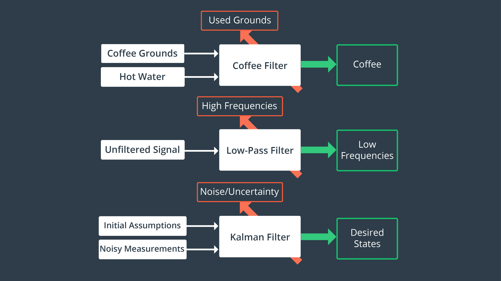

### 2.3 History

The Kalman filter was invented by Rudolf Kalman during a pivotal time in American history.

* **Introduction to the Kalman Filter:**

  Developed to address the challenges faced by NASA in trajectory estimation for the Apollo program.
* **NASA's Challenges:**

  Existing algorithms struggled with the nonlinear problem of accurately guiding spacecraft around the moon, particularly given the limited computing power of the 1960s.
* **Irregular Measurements:**

  During the flight, measurements arrived at irregular intervals, which existing algorithms could not process effectively.
* **Impact of the Kalman Filter:**

  After refinements, the Kalman filter provided the necessary navigational accuracy for the Apollo mission, enabling successful orbit entry around the moon.

The significance of the Kalman filter extends beyond space exploration, influencing robotics and aerospace engineering in solving complex navigation problems.

### 2.4 Applications

The Kalman filter has been widely used since its success with the Apollo program. It is a practical algorithm in controls engineering, applied across various disciplines to estimate the state of a system when measurements are noisy.

* **Engineering Applications:**
  * Estimating fluid levels in tanks.
  * Tracking the position of mobile robots.
* **Economics:**
  * Estimating currency exchange rates.
  * Predicting global domestic products.
* **Computer Vision:**
  * Feature tracking for object recognition and motion estimation.

Its versatility allows it to be applied in diverse fields where state estimation is required despite noisy or incomplete data.

### 2.5 Types of Kalman Filters

There are three common types of Kalman filters: the  **Standard Kalman Filter**, the  **Extended Kalman Filter (EKF)**, and the  **Unscented Kalman Filter (UKF)**.

* **Standard Kalman Filter:**
  * Suitable for  **linear systems**, where the output is directly proportional to the input.
* **Extended Kalman Filter (EKF):**
  * Designed for  **non-linear systems**, which are more common in real-world applications, especially in robotics.
* **Unscented Kalman Filter (UKF):**
  * Another  **non-linear estimator**, particularly effective for highly non-linear systems where the EKF may struggle to converge.

The lesson focuses on the  **Kalman filter and the EKF**, while providing resources for further learning about the UKF.

**Additional Resource:**

[UKF in SLAM - University of Freiburg](http://ais.informatik.uni-freiburg.de/teaching/ws12/mapping/pdf/slam05-ukf.pdf)

### 2.6 Robot Uncertainty

Robot uncertainty is a crucial factor in real-world navigation, arising from the difference between **ideal motion** and  **real-world conditions**.

* **Ideal vs. Real-World Motion:**

  * In an ideal scenario, a robot moves **precisely** to a target distance.
  * In reality, **terrain imperfections, wheel slip, and external factors** introduce uncertainty in movement.
* **Uncertainty as a Probability Distribution:**

  * When a robot moves multiple times, its possible positions form a  **Gaussian-like probability distribution**.
  * The robot is most likely to stop near the target distance but can also deviate due to environmental factors.
  * As movement continues, uncertainties  **accumulate**, making its position **less certain** over time.
* **Effect of Sensor Noise:**

  * Sensors used to estimate the robot's speed may introduce  **measurement noise**, further complicating localization.
* **Changing Uncertainty Over Distance:**

  * The **distribution around the 20m mark may be wider** than at 30m, meaning uncertainty increased over that range due to wheel slip or external forces.
  * However, if randomness (e.g., slip or disturbances) was lower between  **20m and 30m**, the position estimate might  **become more certain**, leading to a **narrower** distribution at 30m.

  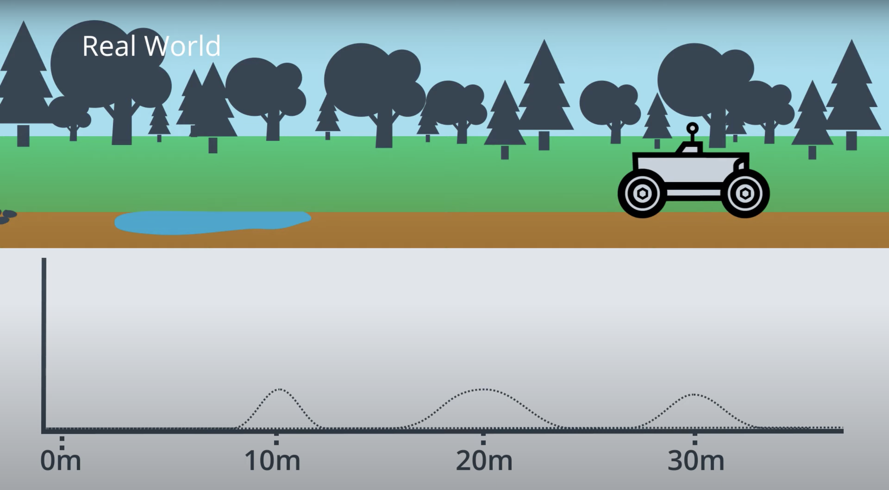
* **Data-Driven Localization Improvement:**

  * In real-world localization, as a robot  **collects more data**, its position estimate can **become more concentrated** around its true location.

Robots must account for these uncertainties to navigate effectively in **dynamic** and **imperfect** environments.

### 2.7 Kalman Filter Advantage

The Kalman filter provides significant advantages in robotics and other applications by improving state estimation despite uncertainty in both **movements** and  **sensor measurements**.

* **Fast and Accurate Estimation:**
  * Quickly refines an accurate estimate of a variable (e.g., a robot’s location) using just a  **few sensor measurements**.
* **Combining Predictions with Measurements:**
  * Integrates **initial guesses** with new sensor readings.
  * Accounts for **expected uncertainty** in both movement predictions and sensor data.
* **Sensor Fusion:**
  * Uses multiple sensors (e.g.,  **GPS and onboard sensors** ) to enhance accuracy.
  * Helps mitigate errors from individual noisy measurements by combining data sources.

The Kalman filter remains a **powerful tool** for making sense of uncertain data in  **robotics, aerospace, and other fields**.

### 2.8 1D Gaussian

At the core of the **Kalman Filter** is the  **Gaussian distribution**, also known as the **bell curve** or  **normal distribution**.

* **Gaussian Representation of Rover’s Motion:**
  * After one motion, the rover’s location is represented by a  **Gaussian distribution**.
  * The  **exact location is uncertain**, but the  **uncertainty is bounded**.
  * It is unlikely for the rover to be significantly far from the target location (e.g., appearing at 50 meters would be nearly impossible).
* **Role of the Kalman Filter:**
  * After a movement or a measurement update, the  **output is a unimodal Gaussian distribution**.
  * This Gaussian represents the **best estimate** of the true value of a parameter.

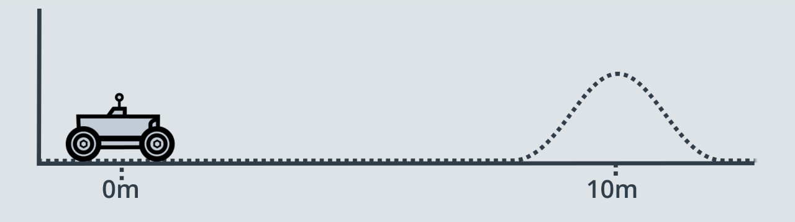

#### **Gaussian Distribution and Probability**

A **Gaussian distribution** is a  **continuous probability function**. The probability of a variable **x** taking a value between **x1** and **x2** is given by:

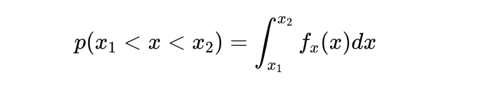

For example, if the probability of the **rover being between 8.7m and 9m** is  **7%**, this probability is determined by integrating the Gaussian function over that range.

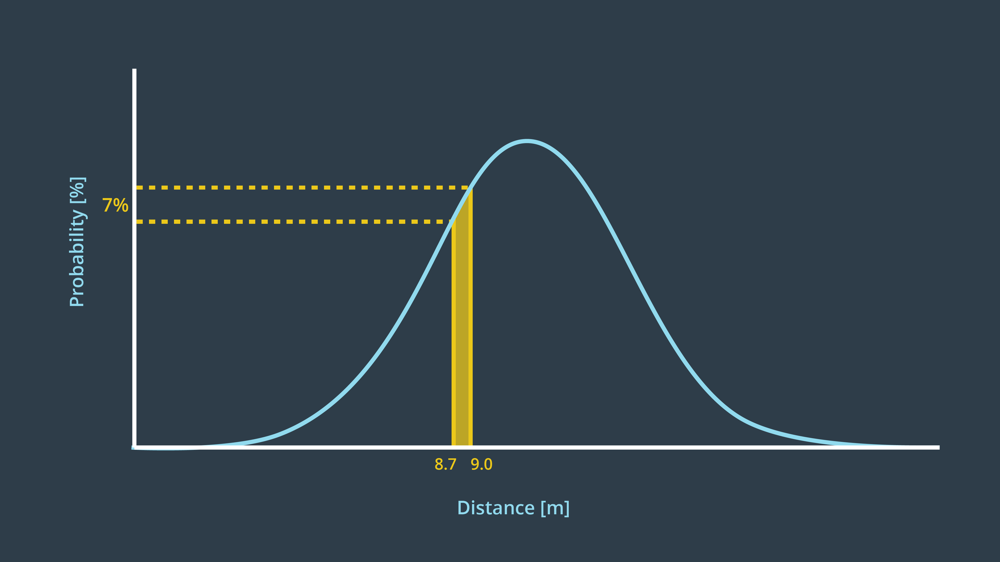

#### **Mean and Variance**

A **Gaussian distribution** is defined by  **two parameters**:

* **Mean (μ):** The  **most probable value**, located at the **center** of the distribution.
* **Variance (σ²):** Determines the **spread (width)** of the curve.

A **unimodal Gaussian** means that there is a **single peak** in the distribution.

* **Notation:**

  Gaussian distributions are represented as:

  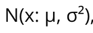

  This notation will be used throughout upcoming lessons.

#### **Gaussian Probability Formula**

The **probability density function (PDF)** for a **Gaussian distribution** is:

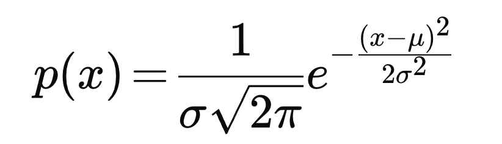

* The exponential term  **compares **x** to **μ****.
* When **x**=**μ**, the exponent **equals zero** and e^0=1, meaning the peak occurs at μ.
* The **constant before the exponential** ensures the total area under the function sums to 1.

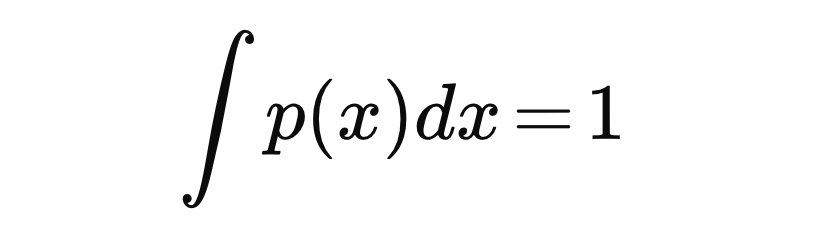

This property ensures that the  **probabilities of all possible values sum to one**, just like in discrete probability (e.g., a **coin toss** where total probabilities equal 100%).

#### **Implementing the Gaussian in C++**

The upcoming lesson focuses on coding the  **Gaussian function in C++**, allowing computation of probabilities for different values given a **mean (μ)** and  **variance (σ²)**.

```cpp
#include <iostream>
#include <math.h>

using namespace std;

double f(double mu, double sigma2, double x)
{
    //Use mu, sigma2 (sigma squared), and x to code the 1-dimensional Gaussian
    double prob = 1.0 / sqrt(2.0 * M_PI * sigma2) * exp(-0.5 * pow((x - mu), 2.0) / sigma2);
    return prob;
}

int main()
{
    cout << f(10.0, 4.0, 8.0) << endl;
    return 0;
}
```

#### **Quiz: Kalman Filter and Gaussian Distributions**

**Question 1:**

If you had to pick a Gaussian to represent the location of your rover, which of the following would you prefer?

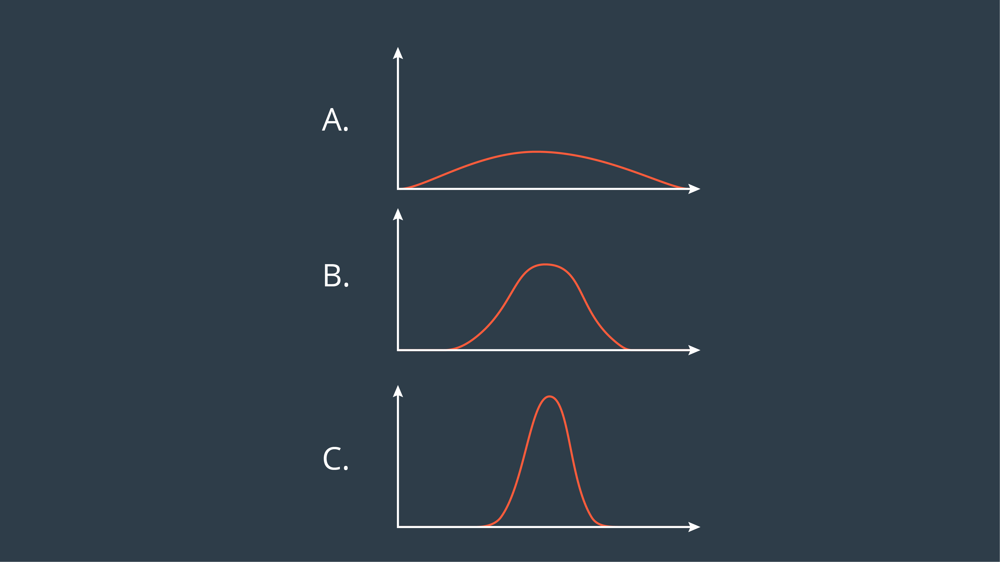

* [ ] A
* [ ] B
* [ ] C

**Correct Answer:** ✅ C

* A **narrow Gaussian (C)** represents a **low-uncertainty** estimate, meaning the rover's position is well-determined.
* A **wide Gaussian (A, B)** represents  **high uncertainty**, meaning the rover's location is less precise.
* In localization, a **more concentrated (narrow) Gaussian is preferred** because it indicates greater certainty in the estimate.

**Question 2:**

What is represented by a Gaussian distribution? Check all that apply.

* [ ] Predicted Motion
* [ ] Sensor Measurement
* [ ] Estimated State of Robot

**Correct Answers:** ✅ Predicted Motion, ✅ Sensor Measurement, ✅ Estimated State of Robot

* **Predicted Motion:** The robot's motion is uncertain, and a **Gaussian** represents this uncertainty.
* **Sensor Measurement:** Sensors provide noisy measurements, which are modeled as  **Gaussian distributions**.
* **Estimated State of Robot:** The Kalman filter **estimates** the robot’s state as a  **Gaussian**, refining it over time with new data.

🔹 **Key Insight:** The Kalman filter assumes all noise is  **unimodal Gaussian**, making it **optimal** when this assumption holds.

**Question 3:**

Can a state with this probability distribution be solved using the Kalman Filter?

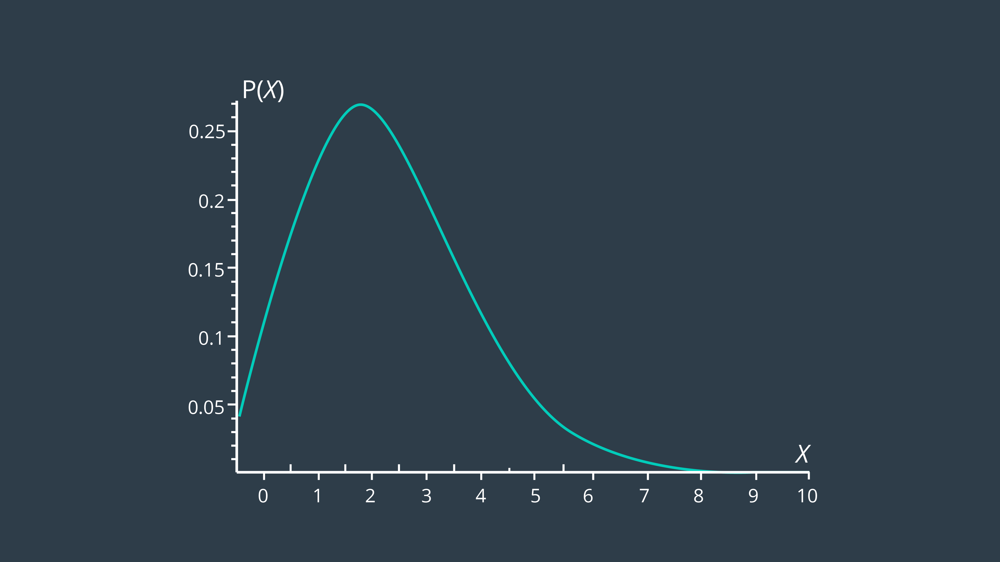

* [ ] Yes
* [ ] No

**Correct Answer:** ✅ No

* The  **Kalman filter requires Gaussian distributions**, which are  **symmetric and unimodal**.
* The given distribution  **is asymmetric (skewed)**, meaning a  **Kalman filter would not work optimally**.
* **Alternative:** For non-Gaussian distributions, **particle filters** or **other Bayesian approaches** are more suitable.

### **2.9 Designing 1D Kalman Filters**

The **Kalman filter algorithm** is used for estimating the **state of a system** when measurements contain  **uncertainty**.

* **Naming Conventions:**

  * **State (x):** Represented using a bold letter.
  * **Measurement (z):** Represents sensor readings.
  * **Control Actions (u):** Represents external inputs affecting the system.

  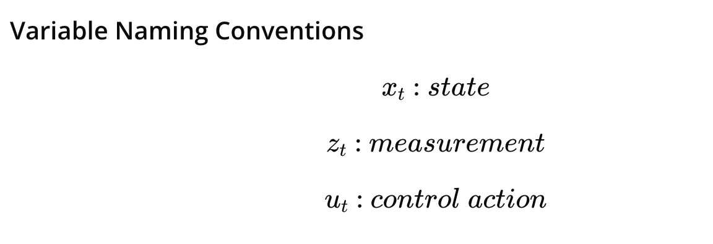
* **Two Main Steps of the Kalman Filter:**

  1. **Measurement Update:**
     * Incorporates sensor measurements to refine the estimate of the state.
  2. **State Prediction:**
     * Accounts for uncertainty introduced by  **robot motion**.

  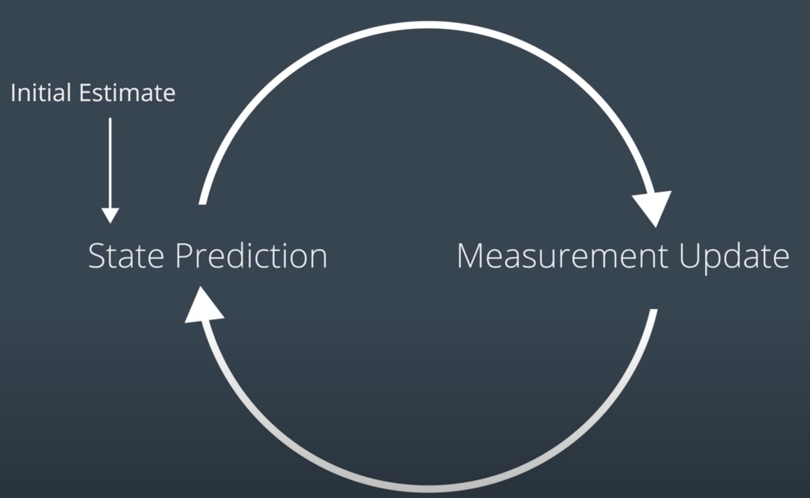
* **Key Insight:**

  * The  **initial estimate of the state does not need to be accurate**.
  * The Kalman filter **quickly converges** to a  **reliable estimate**.
* **Next Steps in Learning:**

  * **Start with a 1D Kalman filter**, then extend to  **multidimensional filters**.
  * Implement the algorithm in  **C++**.
  * Explore the **Extended Kalman Filter (EKF)** for solving **real-world robot localization** problems.

### **2.10 Measurement Update**

#### **Mean Calculation**

* **μ** (Mean of the prior belief)
* **σ2** (Variance of the prior belief)
* **v** (Mean of the measurement)
* **r2** (Variance of the measurement)

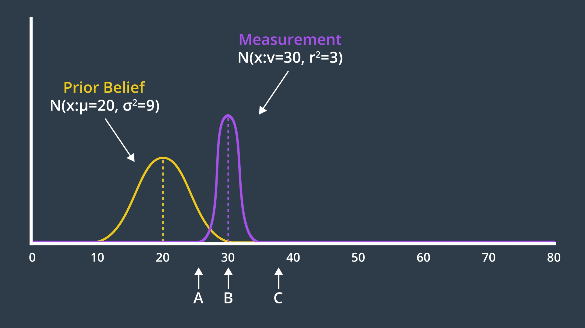

The new mean is a **weighted sum** of the prior belief and measurement means. Since  **a larger variance represents more uncertainty**, the new mean should be  **biased towards the measurement update**, which has a **smaller variance** than the prior.

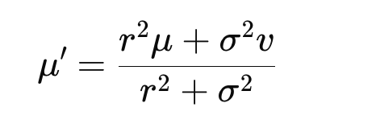

The uncertainty of the **prior** is multiplied by the  **mean of the measurement**, giving it  **more weight**. Similarly, the uncertainty of the **measurement** is multiplied by the  **mean of the prior**. Applying this formula results in a  **new mean of 27.5**, which is visualized in the graph below.

The two Gaussians **provide more information together** than either Gaussian individually. This results in the **new state estimate** being  **more confident**, meaning it has a **higher peak** and  **narrower spread**.

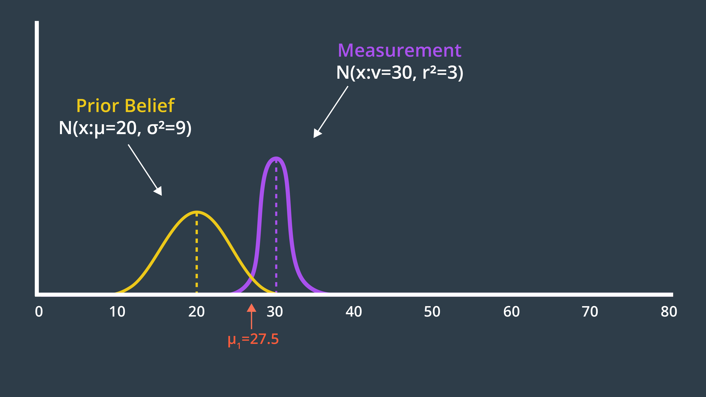

#### **Variance Update Formula**

The formula for the **new variance** is:

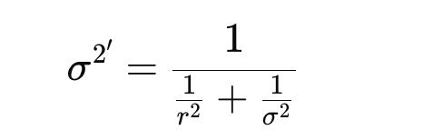

Substituting values from the example results in a  **new variance of 2.25**. This **posterior estimate** is visualized in the diagram below.

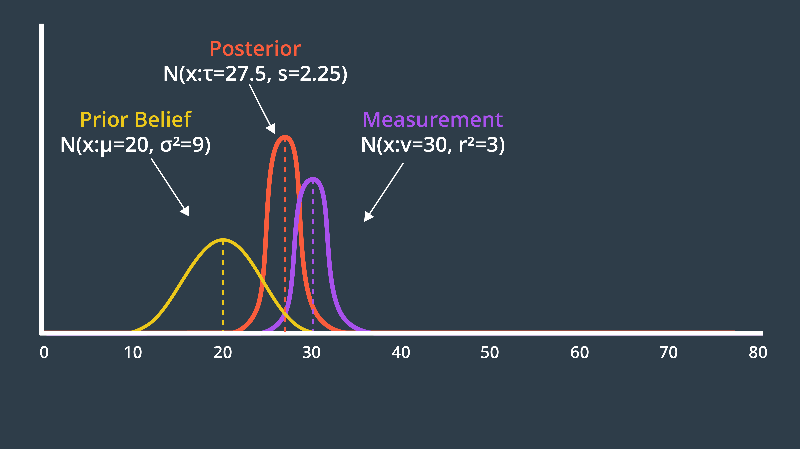

* **μ** Mean of the prior belief
* **σ2** Variance of the prior belief
* **v** Mean of the measurement
* **r2** Variance of the measurement
* **τ**: Mean of the posterior
* **s2**: Variance of the posterior

#### **Implementation in C++**

The **measurement update function** returns two values:

* **New mean**
* **New variance**

Since C++ does not natively support returning multiple values, a **tuple** is used.

```cpp
#include <iostream>
#include <math.h>
#include <tuple>

using namespace std;

double new_mean, new_var;

tuple<double, double> measurement_update(double mean1, double var1, double mean2, double var2)
{
    new_mean = ((mean1 * var2) + (mean2 * var1)) / (var1 + var2); // Mean update formula
    new_var = 1 / ((1 / var1) + (1 / var2)); // Variance update formula
    return make_tuple(new_mean, new_var);
}

int main()
{
    tie(new_mean, new_var) = measurement_update(20, 9, 30, 3);
    printf("[%f, %f]", new_mean, new_var);
    return 0;
}

```

### **2.11 State Prediction**

State prediction is the **second step** in the Kalman filter’s iterative cycle. This step **estimates the new state** after a motion, incorporating uncertainty from the movement.

* **Key Concept:**
  * After the  **measurement update**, the **posterior distribution** becomes the  **new prior**.
  * The  **robot moves forward 7.5 meters**, generating a **Gaussian distribution** centered around this motion with a variance of  **5 meters**.
  * The new state estimate is computed by **adding the motion mean to the prior mean** and  **combining their variances**.

#### **State Prediction Formulas**

**Posterior Mean Calculation:**

* The **new mean** is simply the sum of the prior mean and the motion mean.

**Posterior Variance Calculation:**

* The **new variance** is the sum of the prior variance and the motion variance.

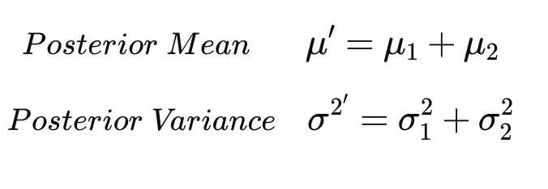

#### **Implementation in C++**

The **state prediction function** takes:

* **Prior mean (μ₁) and variance (σ₁²)**
* **Motion mean (μ₂) and variance (σ₂²)**

It **returns** the updated  **mean and variance**.

```cpp
#include <iostream>
#include <math.h>
#include <tuple>

using namespace std;

double new_mean, new_var;

tuple<double, double> state_prediction(double mean1, double var1, double mean2, double var2)
{
    new_mean = mean1 + mean2;  // State prediction mean formula
    new_var = var1 + var2;  // State prediction variance formula
    return make_tuple(new_mean, new_var);
}

int main()
{
    tie(new_mean, new_var) = state_prediction(10, 4, 12, 4);
    printf("[%f, %f]", new_mean, new_var);
    return 0;
}

```

### **2.12 1D Kalman Filter**

The **1D Kalman Filter** follows an **iterative cycle** of:

1. **Measurement Update:**
   * A **weighted sum** of the prior belief and the measurement.
2. **State Prediction:**
   * The **prior mean and variance** are updated by incorporating the  **motion mean and variance**.

#### **Implementation Details**

* **Measurement Updates & State Predictions**
  * Iterates through  **measurements and motions**.
  * Applies a **measurement update** followed by a **state prediction** at each step.
* **Example Setup**
  * **Initial position estimate:** 35 meters
  * **Variance:** 4 (indicating a high level of certainty).
  * **5 iterations** to track state convergence.
* **Terminology Correction**
  * **motion_variance** instead of **motion_sig**
  * **measurement_variance** instead of **measurement_sig**
  * Sigma (σ) typically  **refers to standard deviation, not variance**.

#### C++ Implementation of the 1D Kalman Filter

```cpp
#include <iostream>
#include <math.h>
#include <tuple>

using namespace std;

double new_mean, new_var;

// Measurement Update Function
tuple<double, double> measurement_update(double mean1, double var1, double mean2, double var2)
{
    new_mean = (var2 * mean1 + var1 * mean2) / (var1 + var2);  // Weighted mean formula
    new_var = 1 / (1 / var1 + 1 / var2);  // Updated variance formula
    return make_tuple(new_mean, new_var);
}

// State Prediction Function
tuple<double, double> state_prediction(double mean1, double var1, double mean2, double var2)
{
    new_mean = mean1 + mean2;  // Predict next mean position
    new_var = var1 + var2;  // Predict new variance
    return make_tuple(new_mean, new_var);
}

int main()
{
    // Measurements and measurement variance
    double measurements[5] = { 5, 6, 7, 9, 10 };
    double measurement_variance = 4;
  
    // Motions and motion variance
    double motions[5] = { 1, 1, 2, 1, 1 };
    double motion_variance = 2;
  
    // Initial state
    double mu = 40;    // Initial mean
    double sig = 1000; // Initial variance
  
    // Iterating through all measurements and motions
    for(int i = 0; i < 5; i++)
    {
        // Apply a measurement update
        tie(mu, sig) = measurement_update(measurements[i], measurement_variance, mu, sig);
        printf("update:  [%f, %f]\n", mu, sig);

        // Apply a state prediction
        tie(mu, sig) = state_prediction(mu, sig, motions[i], motion_variance);
        printf("predict: [%f, %f]\n", mu, sig);
    }
  
    return 0;
}

```

#### **Expected Behavior**

1. **Updates the belief** about position after incorporating new  **sensor measurements**.
2. **Predicts the next state** based on movement commands.
3. The  **Kalman filter continuously refines the estimate**,  **reducing uncertainty over time**.

This implementation is the foundation for **more complex multi-dimensional Kalman filters** used in  **robot localization and tracking**.

### **2.13 Multivariate Gaussian**

**Multivariate Gaussians** extend the concept of **one-dimensional Gaussians** to  **multiple dimensions**, which is essential for real-world applications like  **tracking a robot in 2D space**.

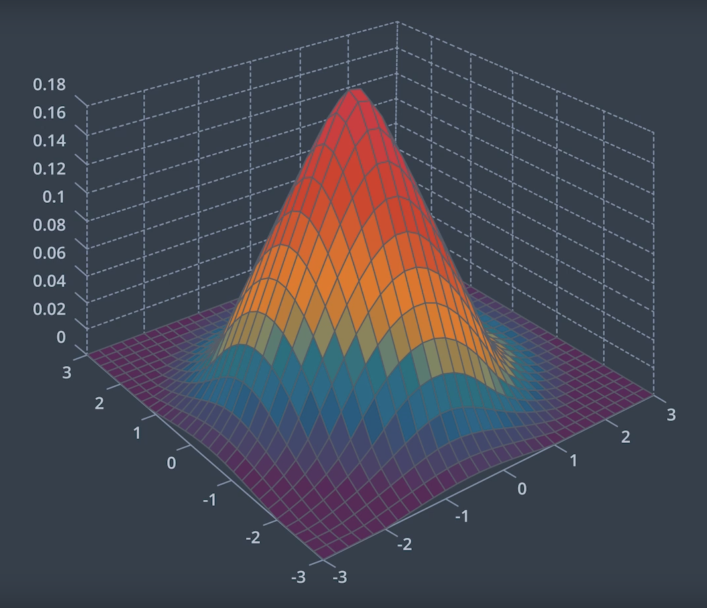

#### **Key Concepts**

* **Multivariate Gaussian Distribution:**
  * Represents **multiple dimensions** (e.g., x & y positions of a robot).
  * The **mean** is now a  **vector**, and the **covariance** is a  **matrix**.
* **Mean and Covariance:**
  * The **mean vector** defines the **center** of the distribution:
    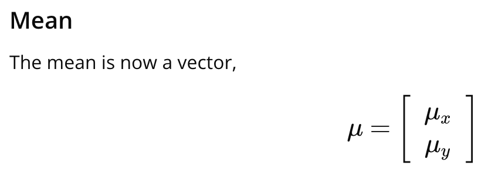
  * The **covariance matrix** describes the **spread** and **correlation** between dimensions:
    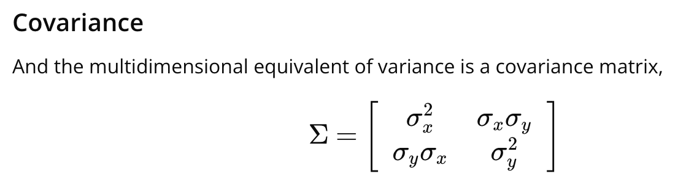

    * **σx2, σy2** → Variances in each dimension.
    * **σxy, σyx** → Correlation terms (non-zero if dimensions are correlated).
* **Shape of the Distribution:**
  * **Circular** when  **variances are equal and small**.
  * **Elliptical** when  **one variance is larger**, showing more certainty in one dimension.
  * **Skewed** when **correlation terms exist** (distribution tilts in one direction).
* **Mathematical Representation:**
  * The **eigenvalues and eigenvectors** of the **covariance matrix** define the  **amount and direction of uncertainty.**

#### **Multivariate Gaussian Formula**

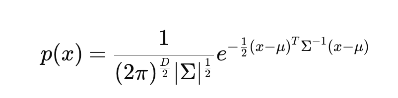

* **x** → State vector.
* **μ** → Mean vector.
* **Σ** → Covariance matrix.
* **D** → Number of dimensions.
* **∣Σ∣** → Determinant of covariance matrix.
* **Σ−1** → Inverse of covariance matrix.

For  **D = 1D**, the equation **simplifies** to the familiar  **1D Gaussian formula**.

### **2.14 Introduction to Multidimensional Kalman Filters (KF)**

The **Multidimensional Kalman Filter (KF)** extends the **1D Kalman Filter** to  **N-dimensional systems**, allowing tracking of multiple **state variables** simultaneously.

#### **Key Concepts**

##### **State Representation**

* **1D Systems:** The state is represented by a **single variable** (e.g., position).
* **N-Dimensional Systems:** The state is represented as a **vector** with multiple state variables.
  * Example: **2D case** where the state includes:
    * **Position (x, y)**
    * **Velocity (x˙,y˙)**

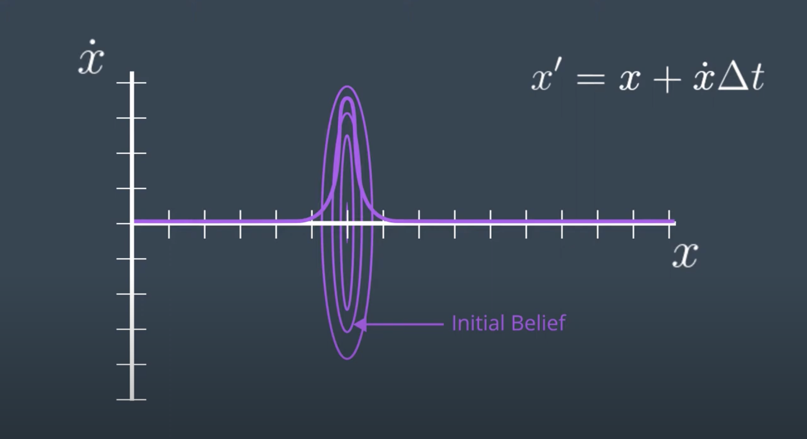

##### **Observable vs. Hidden States**

* **Observable State Variables:** Directly measurable (e.g., robot’s  **position** ).
* **Hidden State Variables:** Cannot be directly measured but can be **inferred** (e.g.,  **velocity** ).

#### **Kalman Filter Process**

##### **1. State Prediction**

* Uses **previous state estimates** and **motion models** to predict the new state.
* Accounts for **uncertainty** in the motion model.
* The **Gaussian distribution** represents the predicted  **position and velocity**.

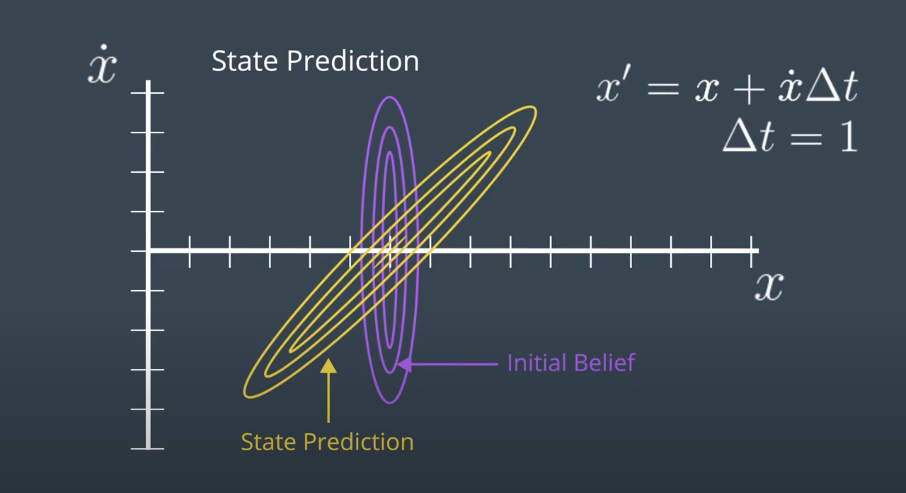

##### **2. Measurement Update**

* Incorporates **sensor measurements** to refine the  **state prediction**.
* Adjusts estimates for  **both observable and hidden states**.
* **Fusion of new data** improves overall accuracy.

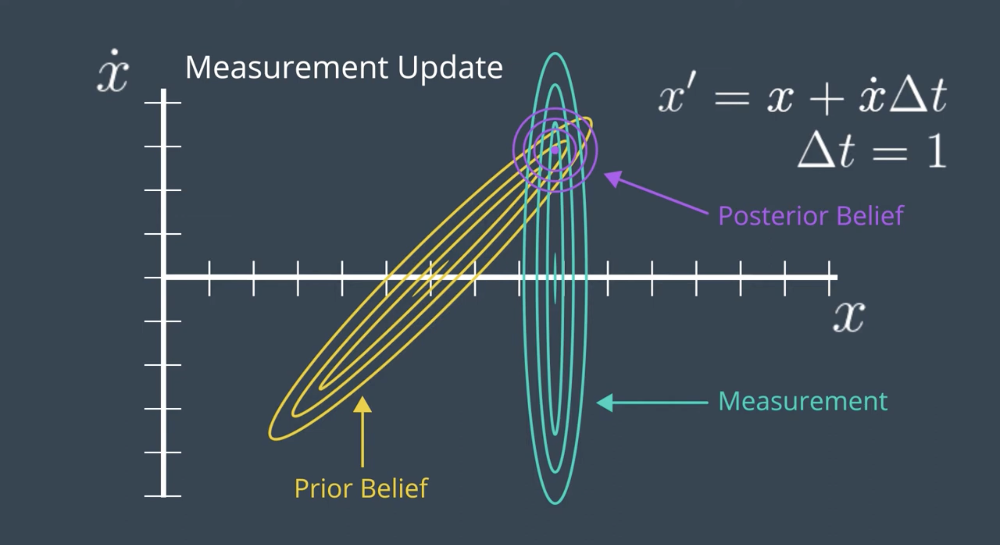

##### **3. Iterative Process**

* The **Kalman filter continuously refines estimates** through repeated  **prediction & update steps**.
* Over time, the **state estimate converges** to the robot’s actual state.

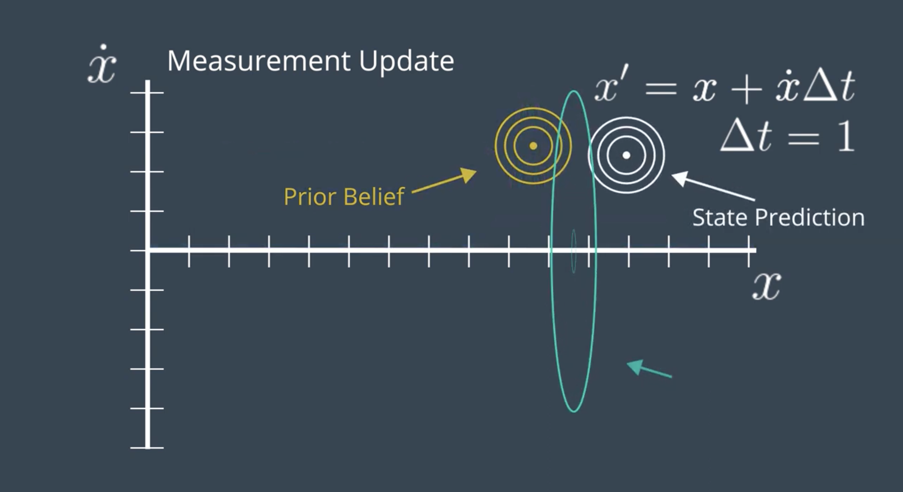

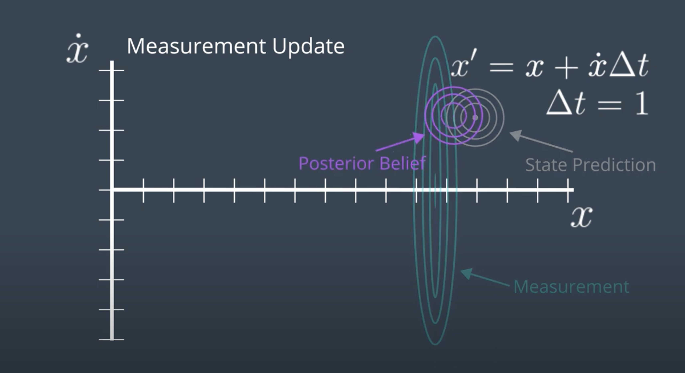

### **2.15 Design of Multi-Dimensional Kalman Filters**

From this point forward, we transition to **linear algebra** to handle **multi-dimensional Kalman Filters (KF)** efficiently.

#### **State Transition**

The **state transition function** advances the  **state from time t** to time **t+1**.

For  **1D motion**, assuming a  **constant velocity model**:

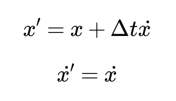

Using  **matrix form**, we represent the transition as:

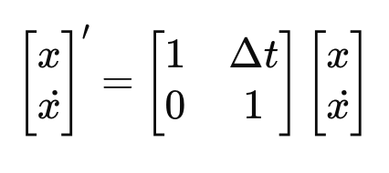

where:

* **x′** → **New position** after time **Δt**
* **x˙** → **Velocity remains constant**

This **state transition function** is denoted as  **F**:


In reality, **process noise** is also involved:

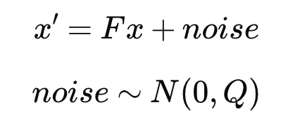

> **Q** accounts for **uncertainty** in motion (e.g., sudden speed changes or external forces).

#### **Covariance Update**

While **Σ** is used for covariance in general statistics, **state covariance in localization** is often denoted as  **P**.

If the **state x** is multiplied by **F**, the **covariance is updated** by the  **square of F**:

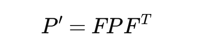

However, real-world motion introduces  **additional uncertainty**. The **updated posterior covariance** is:

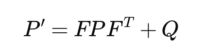

where **Q** accounts for  **process noise**.

#### **Quiz 1: 2D Motion (Position & Velocity in x & y)**

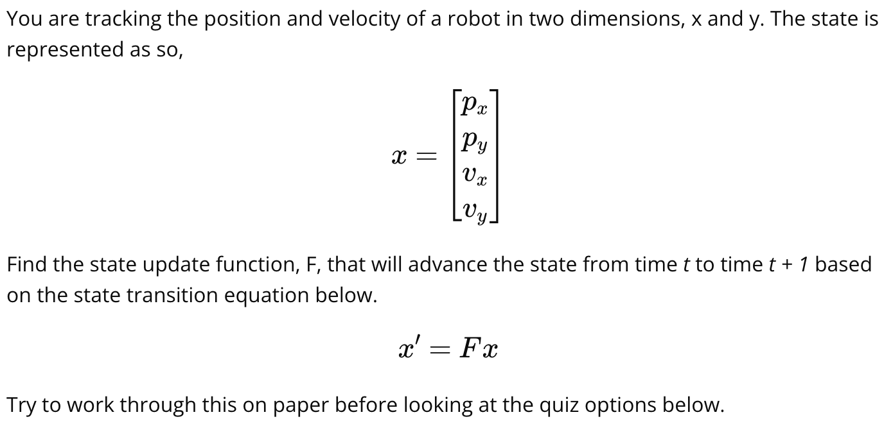

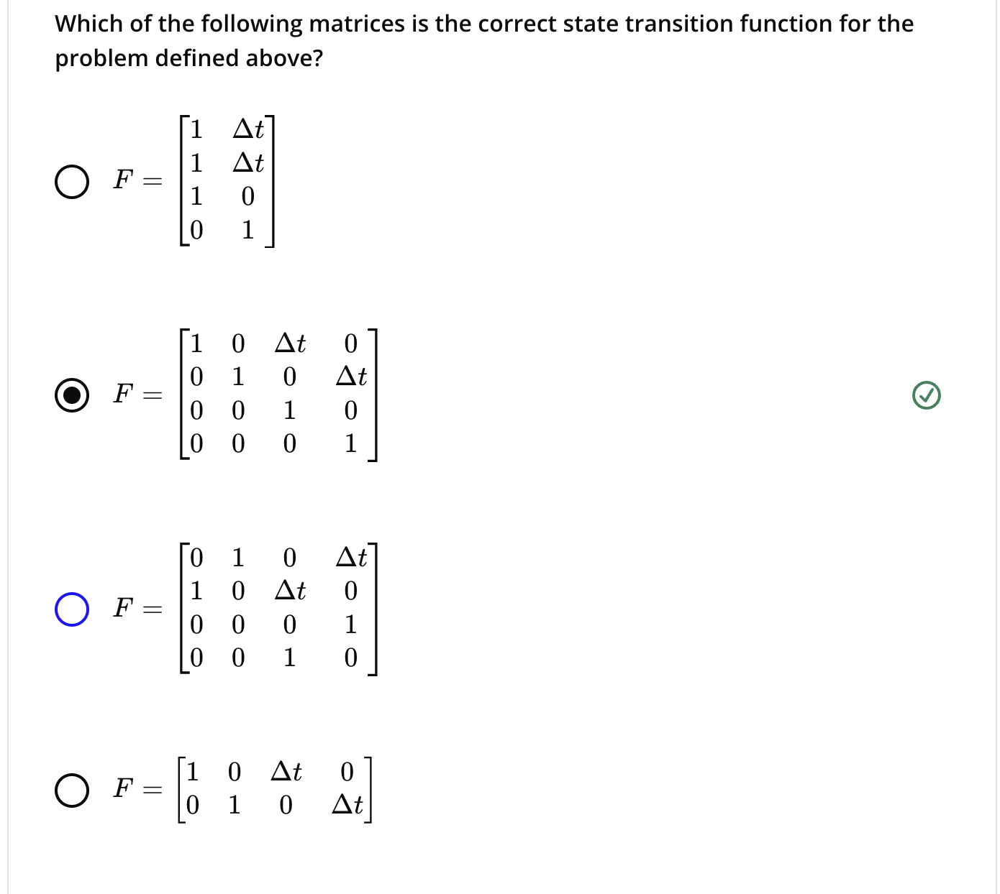

#### **Quiz 2: Quadrotor in Vertical Dimension (z)**

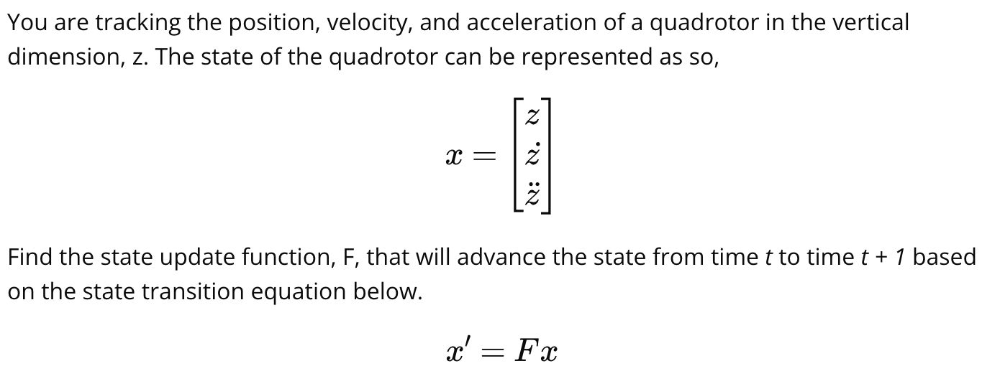

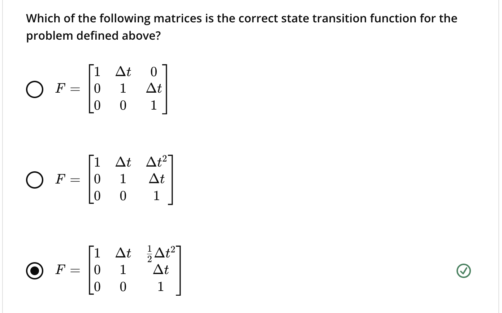

#### **Measurement Update**

The **measurement function** maps the **state (x)** to **observed measurements (z)**.

For **position-only** measurements:

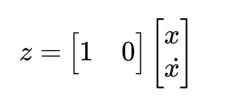

This **measurement function H** defines the mapping.

#### **Kalman Gain & Measurement Residual**

To  **correct the predicted state**, compute the  **measurement residual**:

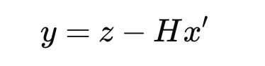

To incorporate  **measurement noise (R)**, compute the  **innovation covariance**:

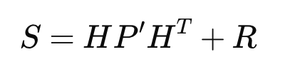

Now, compute the  **Kalman Gain K** and update the  **state estimate**:

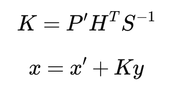

#### **Covariance Update**

Finally, update the  **covariance matrix. The last step in the Kalman Filter is to update the new state’s covariance using the Kalman Gain:**

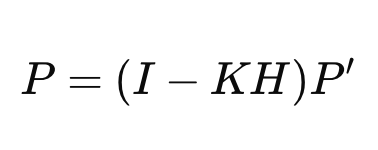

#### Kalman Filter Equations

These are the equations that implement the Kalman Filter in multiple dimensions.

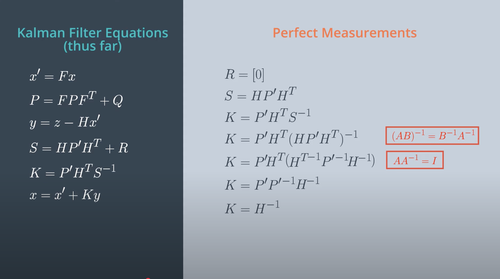

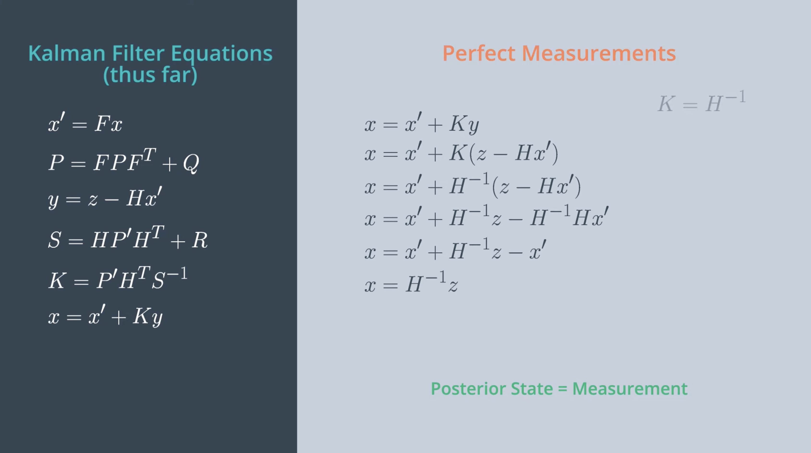

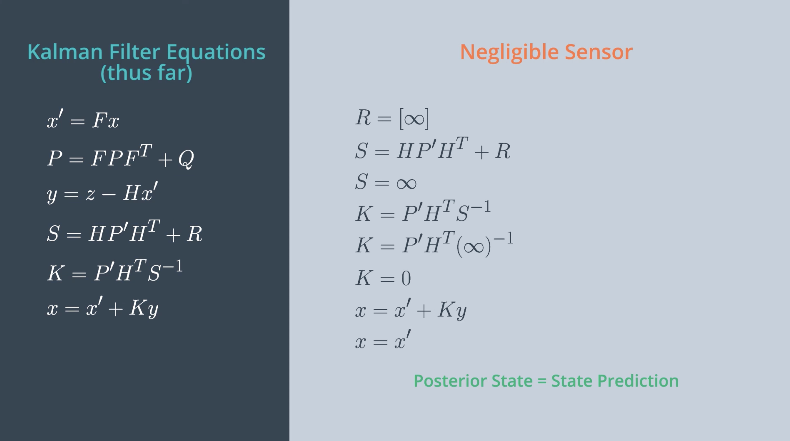

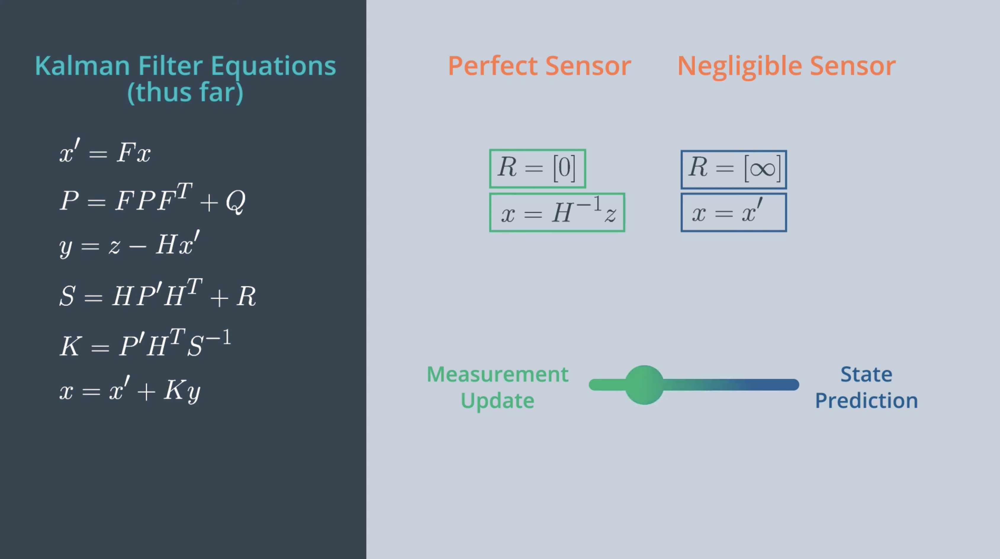

### **C++ Implementation of Multi-Dimensional Kalman Filter**

The following **C++ code** implements a **Kalman Filter** using **Eigen Library** for matrix operations.

Here's a list of useful commands that you'll need while working on this code:

* Initializing a 2x1 float matrix  **K**: `MatrixXf K(2, 1)`;
* Inserting values to matrix  **K**: `K << 0, 0`
* Computing the transpose of matrix  **K**: `K.transpose()`
* Computing the inverse of matrix  **K**: `K.inverse()`

```cpp

#include <iostream>
#include <math.h>
#include <tuple>
#include "Core" // Eigen Library
#include "LU"   // Eigen Library

using namespace std;
using namespace Eigen;

float measurements[3] = { 1, 2, 3 };

tuple<MatrixXf, MatrixXf> kalman_filter(MatrixXf x, MatrixXf P, MatrixXf u, MatrixXf F, MatrixXf H, MatrixXf R, MatrixXf I)
{
    for (int n = 0; n < sizeof(measurements) / sizeof(measurements[0]); n++) {

        // Measurement Update
        MatrixXf Z(1, 1);
        Z << measurements[n];

        MatrixXf y(1, 1);
        y << Z - (H * x);

        MatrixXf S(1, 1);
        S << H * P * H.transpose() + R;

        MatrixXf K(2, 1);
        K << P * H.transpose() * S.inverse();

        x << x + (K * y);
        P << (I - (K * H)) * P;

        // Prediction
        x << (F * x) + u;
        P << F * P * F.transpose();
    }

    return make_tuple(x, P);
}

int main()
{
    MatrixXf x(2, 1);// Initial state (location and velocity) 
    x << 0,
    	 0; 
    MatrixXf P(2, 2);//Initial Uncertainty
    P << 100, 0, 
    	 0, 100; 
    MatrixXf u(2, 1);// External Motion
    u << 0,
    	 0; 
    MatrixXf F(2, 2);//Next State Function
    F << 1, 1,
    	 0, 1; 
    MatrixXf H(1, 2);//Measurement Function
    H << 1,
    	 0; 
    MatrixXf R(1, 1); //Measurement Uncertainty
    R << 1;
    MatrixXf I(2, 2);// Identity Matrix
    I << 1, 0,
    	 0, 1; 

    tie(x, P) = kalman_filter(x, P, u, F, H, R, I);
    cout << "x= " << x << endl;
    cout << "P= " << P << endl;

    return 0;
}
```

### **2.16 Introduction to the Extended Kalman Filter**

#### **Linear Kalman Filter: Assumptions and Limitations**

* The Kalman Filter assumes:
  * Linear motion and measurement functions
  * The state can be represented by a unimodal Gaussian distribution
* These assumptions are **limiting** and only suitable for **primitive robots**
* Real-world robots often execute  **non-linear motions**, like curves or circles

#### **Why Linear Works (Recap)**

* Start with a **Gaussian prior** with:

  * Mean: **μ**
  * Variance: **σ2**
* Apply a  **linear function**:

  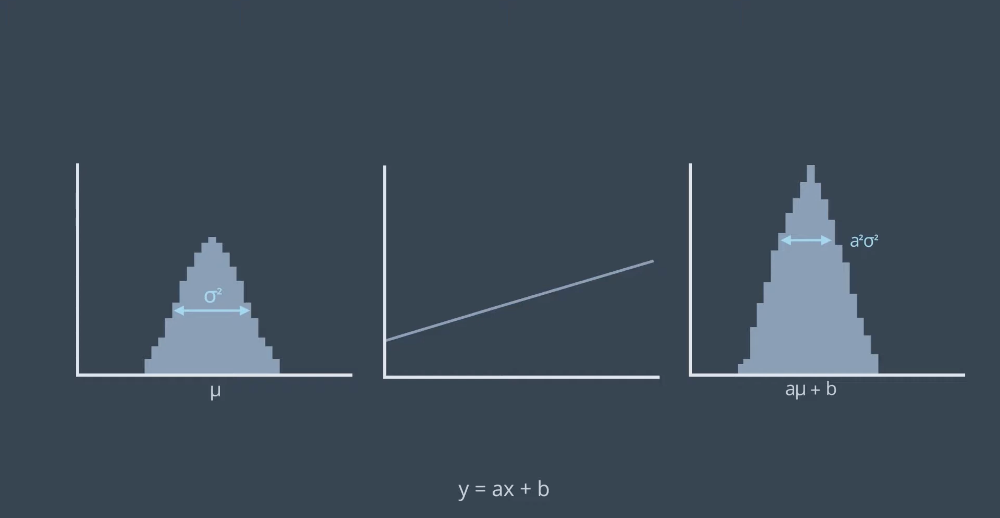
* Result:
  **Mean = aμ+b**, **Variance = a2σ2**
* A **linear transformation of a Gaussian** yields another Gaussian → works perfectly for KF

#### **Why Nonlinear Breaks KF**

* Start with a Gaussian prior again
* Apply a **nonlinear function** **f**(**x**)
* Resulting distribution is:
  * **Not Gaussian**
  * Cannot be computed in closed-form
  * Requires **sampling thousands** of values
  * **Breaks KF’s efficiency and simplicity**

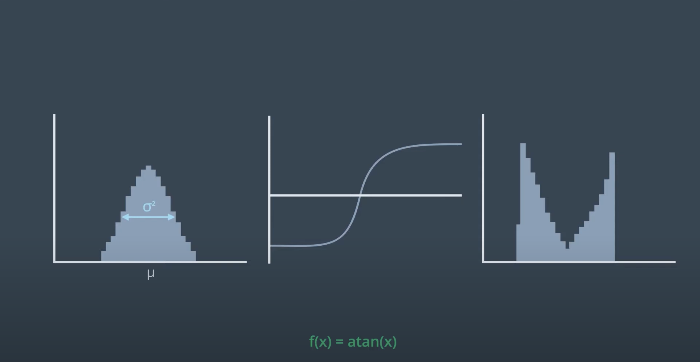

#### **Solution: Local Linearization**

* Zoom into the nonlinear function **f**(**x**)
* Over  **small intervals**, it can be **approximated as linear**

  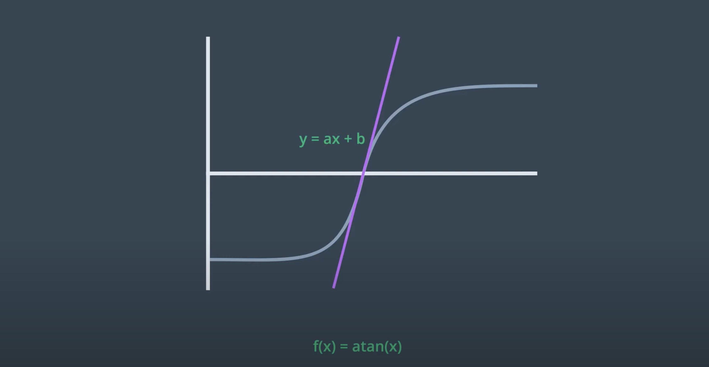
* If centered around the **mean** and updated at each step, it remains:

  * **Sufficiently accurate**
  * **Efficient** to compute
* **Mean** can still be updated using the **nonlinear function**
* **Covariance**, however, must be updated with a **linear approximation**

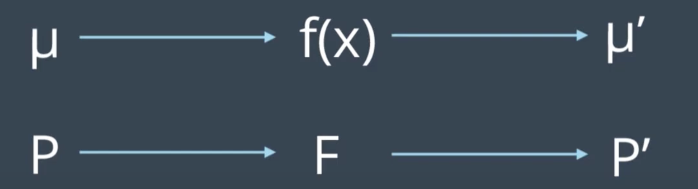

#### **Taylor Series for Linearization**

* General form:

  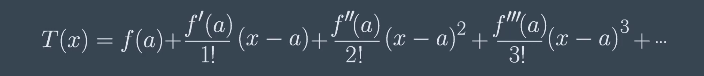
* **Linear approximation** → keep first two terms:
  

#### **Apply to Our Problem**

* Replace the nonlinear transformation with its linear approximation:
  * Example: y=ax+by
* Apply it to the prior → **Result: Gaussian**
* Not perfect, but:
  * **Fast**
  * **Practical**
  * **Usable in real-time robotics**

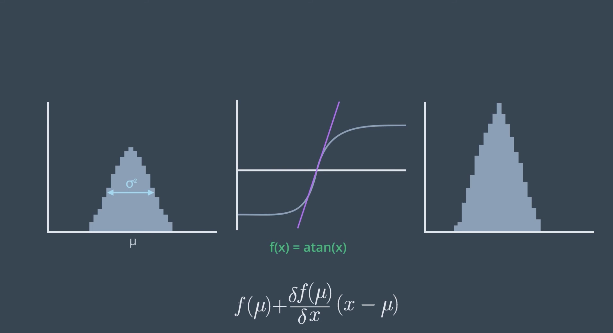

#### **Extended Kalman Filter (EKF) vs. Kalman Filter (KF)**

| Feature                   | Kalman Filter | Extended Kalman Filter         |
| ------------------------- | ------------- | ------------------------------ |
| Motion/Measurement Models | Linear        | Nonlinear                      |
| Mean Update               | Linear        | Nonlinear function allowed     |
| Variance Update           | Linear        | Linearized using Taylor Series |
| Output Distribution       | Gaussian      | Approximate Gaussian           |

#### Summary

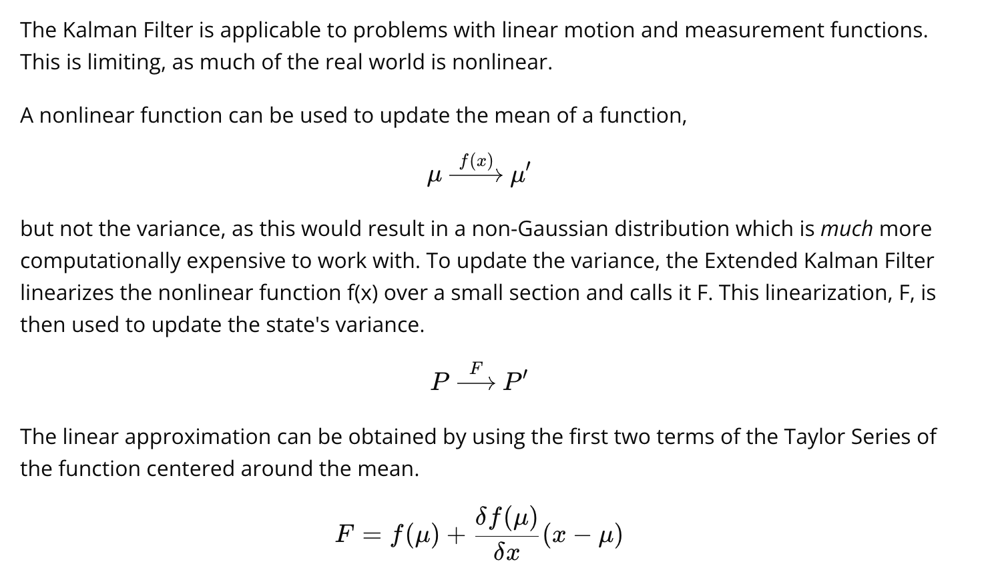

## **Lesson 4: Monte Carlo Localization**

### **4.1 Introduction**

The **Monte Carlo Localization (MCL)** algorithm is introduced as a popular method for  **localizing robots**.

MCL offers advantages over the  **Extended Kalman Filter (EKF)**, particularly in handling:

* Non-linearities in robot motion
* Non-linearities in sensor measurements

#### **Particle Filters**

* MCL uses **particle filters** to represent the **belief state** of the robot.
* A **set of particles** is used, with each particle representing a possible **pose** (position and orientation) of the robot.

#### **Bayes Filter Algorithm**

* The **Bayes filter algorithm** is introduced.
* It is essential for understanding how **MCL estimates the robot’s pose** based on incoming  **sensor data**.

#### **MCL Pseudo Code**

* **Pseudo code for the MCL algorithm** is presented.
* It provides a **high-level overview** of the implementation.

#### **Application**

* The video illustrates  **how MCL can be applied to a robot**.
* It shows that MCL can **accurately estimate the robot’s position** in an environment, even in the presence of  **nonlinearities**.

### **4.2 What's MCL?**

The video explains the **Monte Carlo Localization (MCL)** algorithm, which is **widely used in robotics** for tracking a robot's **position and orientation** within a  **mapped environment**.

#### **Particles in MCL**

* MCL utilizes **particles** to represent **possible locations** of the robot.
* Each particle is a **hypothesis** of the robot’s true position and orientation.
* MCL estimates the robot’s **pose** based on **sensory information** from  **range finder sensors**.

#### **Effectiveness**

* MCL is **effective** for both:
  * **Local localization problems** (robot knows roughly where it is)
  * **Global localization problems** (robot's starting position is completely unknown)

#### **Limitations**

* MCL has  **limitations** :
  * It may **lose track** of the robot if the robot is **moved unexpectedly** (e.g., kidnapped robot problem).

#### **Overall View**

* MCL is portrayed as a **powerful tool** for **robotic navigation** and  **localization**.

### **4.3 Power of MCL**

Monte Carlo Localization (MCL) has advantages over the Extended Kalman Filter (EKF).

#### **MCL Advantages**

* Easier to program compared to EKF.
* Able to represent non-Gaussian distributions.
* Allows control of memory and resolution by adjusting the number of particles.
* Capable of modeling a wide variety of environments.

#### **EKF Limitations**

* Assumes the posterior is always a Gaussian, limiting flexibility.

#### **MCL Strengths**

* Better handling of nonlinearities.
* Robust against unexpected movements, such as in the kidnapped robot scenario.
* Supports global localization.

#### **Comparison: MCL vs EKF**


### **4.4 Particle Filters**

Monte Carlo Localization estimates a robot’s position in a two-dimensional map when its initial location is unknown.

The robot uses onboard range sensors to detect obstacles and determine its location.

Initially, particles are randomly and uniformly distributed throughout the map.

Each particle represents a hypothesis of the robot’s possible position.

Each particle has:

* An x-coordinate
* A y-coordinate
* An orientation vector
* A weight

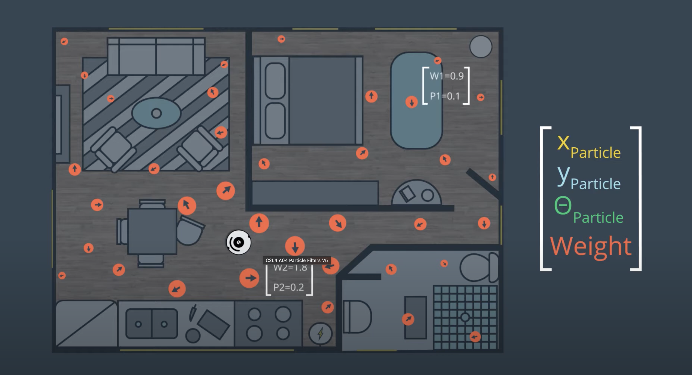

The weight reflects the accuracy of the particle’s hypothesis compared to the robot’s actual pose. Particles with larger weights are more likely to survive during the resampling process.

Over several iterations, the particles converge to provide a more accurate estimate of the robot’s position.

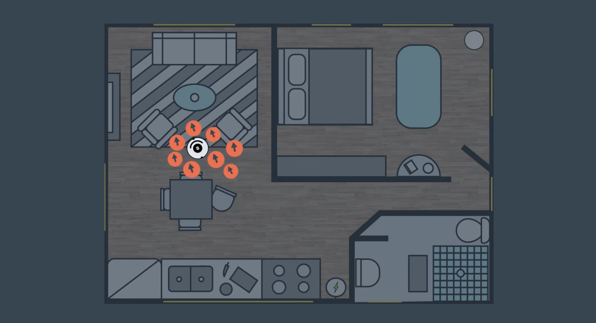

### **4.5 Bayes Filtering**

Monte Carlo Localization estimates the posterior distribution of a robot’s position and orientation based on sensory information.

This process is known as a  **recursive Bayes filter**.

Using a  **Bayes filtering approach**, roboticists can estimate the **state of a dynamical system** from sensor measurements.

#### **Definitions**

* **Dynamical system** : The mobile robot and its environment.
* **State** : The robot’s pose, including its position and orientation.
* **Measurements** : Perception data (e.g., laser scanners) and odometry data (e.g., rotary encoders).

#### **Goal of Bayes Filtering**

The goal is to estimate a **probability density** over the state space conditioned on the measurements.

The probability density, also known as the  **posterior**, is called the **belief** and is denoted as:

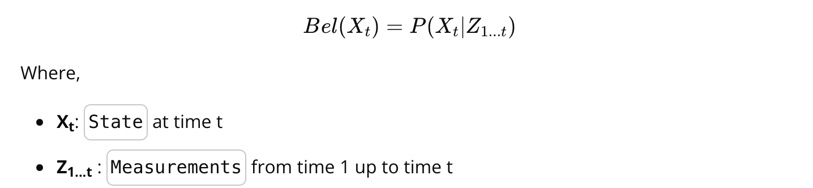

#### **Probability Refresher**

Given a set of probabilities, `P(A∣B)` is calculated as:

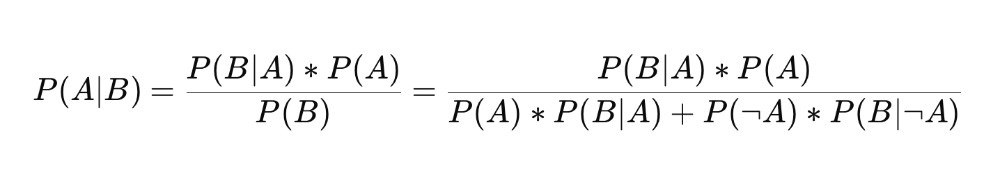

#### **Quiz Scenario**

A robot is located inside of a **1D hallway** with  **three doors**.

The robot doesn't know where it is located, but it has sensors that can detect if it is standing in front of a door or a wall.

The robot collects:

* **Odometry data** to keep track of movement.
* **Perception data** to identify the presence of doors.

Neither the odometry nor the sensors are perfectly accurate.

The goal is to calculate the **state** of the robot given its measurements, known as the  **belief** : `P(Xt∣Z)`.

#### **Quiz Problem**

Given:

* `P(POS)`: Probability of the robot being at the actual position.
* `P(DOOR∣POS)`: Probability of seeing the door given the robot is at the actual position.
* `P(DOOR∣¬POS)`: Probability of seeing the door given the robot is not at the actual position.

Compute:

* `P(POS∣DOOR)`: The belief — the probability the robot is at the actual position given that it sees a door.

```cpp
#include <iostream>
using namespace std;

int main() {
  
    // Given P(POS), P(DOOR|POS), and P(DOOR|¬POS)
    double a = 0.0002; // P(POS) = 0.002
    double b = 0.6;    // P(DOOR|POS) = 0.6
    double c = 0.05;   // P(DOOR|¬POS) = 0.05
  
    // Compute P(¬POS) and P(POS|DOOR)
    double d = 1 - a;                  // P(¬POS)
    double e = (b * a) / ((a * b) + (d * c)); // P(POS|DOOR)
  
    // Print Result
    cout << "P(POS|DOOR)= " << e << endl;
  
    return 0;
}

```

### **4.6 MCL: The Algorithm**

Monte Carlo Localization (MCL) is used for estimating a robot’s pose in an environment.

MCL consists of two main sections represented by two loops:

* **Motion and Sensor Update**
* **Resampling Process**

#### **Initialization**

The algorithm starts by **randomly generating particles** that represent **possible states** of the robot’s position.

Particles represent hypotheses about the robot's true pose.

#### **First Loop: Motion and Sensor Update**

Whenever the robot moves:

* The algorithm computes the **hypothetical state** of each particle based on the robot’s motion.
* It then **updates the particles’ weights** based on the latest  **sensor measurements**.
* Both the **motion update** and **measurement update** are applied to the previous state of each particle.

Particles with states that are more consistent with the sensor data receive  **higher weights**.

#### **Second Loop: Resampling Process**

In the resampling step:

* **Particles with higher weights** are  **more likely to be retained**.
* **Particles with lower weights** are  **discarded**.

This focuses computational effort on the most probable robot poses.

#### **Iteration**

The algorithm **outputs a new belief** about the robot’s position.

The entire cycle repeats with **new motion commands** and  **new sensor measurements**.

Over time, the robot's pose estimate becomes **more accurate** through repeated updates.

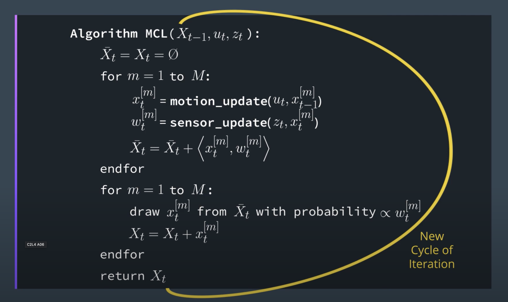

#### 4.7 MCL vs EKF in Action

**1. Monte Carlo Localization (MCL)**


At time:

* **t = 1** : Particles are drawn randomly and uniformly over the entire pose space.
* **t = 2** : Measurement is updated, and an importance weight is assigned to each particle.
* **t = 3** : Motion is updated. A new particle set with uniform weights and a high number of particles around the three most likely places is obtained in resampling.
* **t = 4** : Measurement assigns non-uniform weight to the particle set.
* **t = 5** : Motion is updated and a new resampling step is about to start.

**2. Extended Kalman Filter (EKF)**


At time:

* **t = 1** : Initial belief represented by a Gaussian distribution around the first door.
* **t = 2** : Motion is updated, and the new belief is represented by a shifted Gaussian of increased weight.
* **t = 3** : Measurement is updated. The robot is more certain of its location. The new posterior is represented by a Gaussian with a small variance.
* **t = 4** : Motion is updated and the uncertainty increases.

**Comparison and Key Points:**

* Both the **EKF** and **MCL** algorithms consist of **motion** and **measurement update** stages.
* **MCL** is unrestricted by any state space distribution but can also model Gaussian distributions like  **EKF**.
* In the example, the robot can be locally localized using either **MCL** or  **EKF**.
* The choice of algorithm depends on preference:
  * **MCL** has many advantages and is easier to code.

## **Lesson 5: Build MCL using CPP**

### **5.1 Introduction**

The Monte Carlo Localization (MCL) algorithm is introduced in C++.

It outlines the problem of estimating a robot's pose within a **100x100** two-dimensional map, where:

* The robot can move and measure distances to eight landmarks using a rangefinder sensor.
* The environment is cyclic, allowing the robot to cross walls and reappear on the opposite side.

**Key steps in the MCL algorithm:**

* Moving the robot and measuring distances to landmarks.
* Simulating noise in the measurements.
* Randomly spreading virtual particles throughout the map.
* Evaluating the importance weight of each particle.
* Resampling the particles.
* Generating an error value to assess the solution's quality.
* Plotting the robot's position and the particles at each iteration.

The section sets the stage for coding the MCL algorithm in parts, guiding learners through the process of implementing this localization technique.

### **5.2 Robot Class**

The **Robot class** is introduced for use in the Monte Carlo Localization (MCL) algorithm.

It allows instantiating a robot object with a random position and orientation drawn from a Gaussian distribution.

**Key Features:**

* **Setting the Robot's Pose:**

  A function allows updating the robot’s xx**x**, yy**y** position and orientation.
* **Simulating Noise:**

  Functions add random noise to forward movement, rotation, and sensing.
* **Measuring Distances:**

  The robot can measure distances to **eight landmarks** using a sensing function.
* **Movement:**

  The robot can move forward and rotate using a `move` function, simulating noisy motion.
* **Displaying Information:**

  Functions show the robot’s current pose and its sensed distances to landmarks.

```cpp
//#include "src/matplotlibcpp.h"//Graph Library
#include <iostream>
#include <string>
#include <math.h>
#include <vector>
#include <stdexcept> // throw errors
#include <random> //C++ 11 Random Numbers

//namespace plt = matplotlibcpp;
using namespace std;

// Landmarks
double landmarks[8][2] = { { 20.0, 20.0 }, { 20.0, 80.0 }, { 20.0, 50.0 },
    { 50.0, 20.0 }, { 50.0, 80.0 }, { 80.0, 80.0 },
    { 80.0, 20.0 }, { 80.0, 50.0 } };

// Map size in meters
double world_size = 100.0;

// Random Generators
random_device rd;
mt19937 gen(rd());

// Global Functions
double mod(double first_term, double second_term);
double gen_real_random();

class Robot {
public:
    Robot()
    {
        // Constructor
        x = gen_real_random() * world_size; // robot's x coordinate
        y = gen_real_random() * world_size; // robot's y coordinate
        orient = gen_real_random() * 2.0 * M_PI; // robot's orientation

        forward_noise = 0.0; //noise of the forward movement
        turn_noise = 0.0; //noise of the turn
        sense_noise = 0.0; //noise of the sensing
    }

    void set(double new_x, double new_y, double new_orient)
    {
        // Set robot new position and orientation
        if (new_x < 0 || new_x >= world_size)
            throw std::invalid_argument("X coordinate out of bound");
        if (new_y < 0 || new_y >= world_size)
            throw std::invalid_argument("Y coordinate out of bound");
        if (new_orient < 0 || new_orient >= 2 * M_PI)
            throw std::invalid_argument("Orientation must be in [0..2pi]");

        x = new_x;
        y = new_y;
        orient = new_orient;
    }

    void set_noise(double new_forward_noise, double new_turn_noise, double new_sense_noise)
    {
        // Simulate noise, often useful in particle filters
        forward_noise = new_forward_noise;
        turn_noise = new_turn_noise;
        sense_noise = new_sense_noise;
    }

    vector<double> sense()
    {
        // Measure the distances from the robot toward the landmarks
        vector<double> z(sizeof(landmarks) / sizeof(landmarks[0]));
        double dist;

        for (int i = 0; i < sizeof(landmarks) / sizeof(landmarks[0]); i++) {
            dist = sqrt(pow((x - landmarks[i][0]), 2) + pow((y - landmarks[i][1]), 2));
            dist += gen_gauss_random(0.0, sense_noise);
            z[i] = dist;
        }
        return z;
    }

    Robot move(double turn, double forward)
    {
        if (forward < 0)
            throw std::invalid_argument("Robot cannot move backward");

        // turn, and add randomness to the turning command
        orient = orient + turn + gen_gauss_random(0.0, turn_noise);
        orient = mod(orient, 2 * M_PI);

        // move, and add randomness to the motion command
        double dist = forward + gen_gauss_random(0.0, forward_noise);
        x = x + (cos(orient) * dist);
        y = y + (sin(orient) * dist);

        // cyclic truncate
        x = mod(x, world_size);
        y = mod(y, world_size);

        // set particle
        Robot res;
        res.set(x, y, orient);
        res.set_noise(forward_noise, turn_noise, sense_noise);

        return res;
    }

    string show_pose()
    {
        // Returns the robot current position and orientation in a string format
        return "[x=" + to_string(x) + " y=" + to_string(y) + " orient=" + to_string(orient) + "]";
    }

    string read_sensors()
    {
        // Returns all the distances from the robot toward the landmarks
        vector<double> z = sense();
        string readings = "[";
        for (int i = 0; i < z.size(); i++) {
            readings += to_string(z[i]) + " ";
        }
        readings[readings.size() - 1] = ']';

        return readings;
    }

    double measurement_prob(vector<double> measurement)
    {
        // Calculates how likely a measurement should be
        double prob = 1.0;
        double dist;

        for (int i = 0; i < sizeof(landmarks) / sizeof(landmarks[0]); i++) {
            dist = sqrt(pow((x - landmarks[i][0]), 2) + pow((y - landmarks[i][1]), 2));
            prob *= gaussian(dist, sense_noise, measurement[i]);
        }

        return prob;
    }

    double x, y, orient; //robot poses
    double forward_noise, turn_noise, sense_noise; //robot noises

private:
    double gen_gauss_random(double mean, double variance)
    {
        // Gaussian random
        normal_distribution<double> gauss_dist(mean, variance);
        return gauss_dist(gen);
    }

    double gaussian(double mu, double sigma, double x)
    {
        // Probability of x for 1-dim Gaussian with mean mu and var. sigma
        return exp(-(pow((mu - x), 2)) / (pow(sigma, 2)) / 2.0) / sqrt(2.0 * M_PI * (pow(sigma, 2)));
    }
};

// Functions
double gen_real_random()
{
    // Generate real random between 0 and 1
    uniform_real_distribution<double> real_dist(0.0, 1.0); //Real
    return real_dist(gen);
}

double mod(double first_term, double second_term)
{
    // Compute the modulus
    return first_term - (second_term)*floor(first_term / (second_term));
}

double evaluation(Robot r, Robot p[], int n)
{
    //Calculate the mean error of the system
    double sum = 0.0;
    for (int i = 0; i < n; i++) {
        //the second part is because of world's cyclicity
        double dx = mod((p[i].x - r.x + (world_size / 2.0)), world_size) - (world_size / 2.0);
        double dy = mod((p[i].y - r.y + (world_size / 2.0)), world_size) - (world_size / 2.0);
        double err = sqrt(pow(dx, 2) + pow(dy, 2));
        sum += err;
    }
    return sum / n;
}
double max(double arr[], int n)
{
    // Identify the max element in an array
    double max = 0;
    for (int i = 0; i < n; i++) {
        if (arr[i] > max)
            max = arr[i];
    }
    return max;
}
/*
void visualization(int n, Robot robot, int step, Robot p[], Robot pr[])
{
	//Draw the robot, landmarks, particles and resampled particles on a graph

    //Graph Format
    plt::title("MCL, step " + to_string(step));
    plt::xlim(0, 100);
    plt::ylim(0, 100);

    //Draw particles in green
    for (int i = 0; i < n; i++) {
        plt::plot({ p[i].x }, { p[i].y }, "go");
    }

    //Draw resampled particles in yellow
    for (int i = 0; i < n; i++) {
        plt::plot({ pr[i].x }, { pr[i].y }, "yo");
    }

    //Draw landmarks in red
    for (int i = 0; i < sizeof(landmarks) / sizeof(landmarks[0]); i++) {
        plt::plot({ landmarks[i][0] }, { landmarks[i][1] }, "ro");
    }
  
    //Draw robot position in blue
    plt::plot({ robot.x }, { robot.y }, "bo");

	//Save the image and close the plot
    plt::save("./Images/Step" + to_string(step) + ".png");
    plt::clf();
}
*/

//####   DON'T MODIFY ANYTHING ABOVE HERE! ENTER CODE BELOW ####
int main()
{
    // TODO: Print "I am ready for coding the MCL!"
    cout << "I am ready for coding the MCL!" ; 
    return 0;
}
```

### **5.3 First Interaction**

This section introduces how to **interact with the Robot class** in the Monte Carlo Localization (MCL) framework.

**Key Concepts:**

* **Instantiating a Robot Object:**

  You will create a `Robot` object initialized with a random xx**x**, yy**y** position and orientation.
* **Setting Position and Orientation:**

  You can manually set the robot’s pose using the `set()` method.
* **Printing Robot's Position:**

  You will print the robot’s current position and orientation using `show_pose()`.
* **Moving the Robot:**

  The robot can rotate and move forward using the `move()` method.
* **Calculating Distances:**

  After moving, the robot measures distances to eight landmarks using the `read_sensors()` method.

**Task:**

In the provided C++ quiz, you are asked to:

1. Create a robot object.
2. Set the robot’s pose to (x=10.0,y=10.0,orientation=0)(x = 10.0, y = 10.0, \text{orientation} = 0)**(**x**=**10.0**,**y**=**10.0**,**orientation**=**0**)**.
3. Print the pose.
4. Move the robot by turning π2\frac{\pi}{2}**2**π and moving forward 10.010.0**10.0** units.
5. Print the updated pose.
6. Print the measured distances to landmarks.

```cpp
//#include "src/matplotlibcpp.h"//Graph Library
#include <iostream>
#include <string>
#include <math.h>
#include <vector>
#include <stdexcept> // throw errors
#include <random> //C++ 11 Random Numbers

//namespace plt = matplotlibcpp;
using namespace std;

// Landmarks
double landmarks[8][2] = { { 20.0, 20.0 }, { 20.0, 80.0 }, { 20.0, 50.0 },
    { 50.0, 20.0 }, { 50.0, 80.0 }, { 80.0, 80.0 },
    { 80.0, 20.0 }, { 80.0, 50.0 } };

// Map size in meters
double world_size = 100.0;

// Random Generators
random_device rd;
mt19937 gen(rd());

// Global Functions
double mod(double first_term, double second_term);
double gen_real_random();

class Robot {
public:
    Robot()
    {
        // Constructor
        x = gen_real_random() * world_size; // robot's x coordinate
        y = gen_real_random() * world_size; // robot's y coordinate
        orient = gen_real_random() * 2.0 * M_PI; // robot's orientation

        forward_noise = 0.0; //noise of the forward movement
        turn_noise = 0.0; //noise of the turn
        sense_noise = 0.0; //noise of the sensing
    }

    void set(double new_x, double new_y, double new_orient)
    {
        // Set robot new position and orientation
        if (new_x < 0 || new_x >= world_size)
            throw std::invalid_argument("X coordinate out of bound");
        if (new_y < 0 || new_y >= world_size)
            throw std::invalid_argument("Y coordinate out of bound");
        if (new_orient < 0 || new_orient >= 2 * M_PI)
            throw std::invalid_argument("Orientation must be in [0..2pi]");

        x = new_x;
        y = new_y;
        orient = new_orient;
    }

    void set_noise(double new_forward_noise, double new_turn_noise, double new_sense_noise)
    {
        // Simulate noise, often useful in particle filters
        forward_noise = new_forward_noise;
        turn_noise = new_turn_noise;
        sense_noise = new_sense_noise;
    }

    vector<double> sense()
    {
        // Measure the distances from the robot toward the landmarks
        vector<double> z(sizeof(landmarks) / sizeof(landmarks[0]));
        double dist;

        for (int i = 0; i < sizeof(landmarks) / sizeof(landmarks[0]); i++) {
            dist = sqrt(pow((x - landmarks[i][0]), 2) + pow((y - landmarks[i][1]), 2));
            dist += gen_gauss_random(0.0, sense_noise);
            z[i] = dist;
        }
        return z;
    }

    Robot move(double turn, double forward)
    {
        if (forward < 0)
            throw std::invalid_argument("Robot cannot move backward");

        // turn, and add randomness to the turning command
        orient = orient + turn + gen_gauss_random(0.0, turn_noise);
        orient = mod(orient, 2 * M_PI);

        // move, and add randomness to the motion command
        double dist = forward + gen_gauss_random(0.0, forward_noise);
        x = x + (cos(orient) * dist);
        y = y + (sin(orient) * dist);

        // cyclic truncate
        x = mod(x, world_size);
        y = mod(y, world_size);

        // set particle
        Robot res;
        res.set(x, y, orient);
        res.set_noise(forward_noise, turn_noise, sense_noise);

        return res;
    }

    string show_pose()
    {
        // Returns the robot current position and orientation in a string format
        return "[x=" + to_string(x) + " y=" + to_string(y) + " orient=" + to_string(orient) + "]";
    }

    string read_sensors()
    {
        // Returns all the distances from the robot toward the landmarks
        vector<double> z = sense();
        string readings = "[";
        for (int i = 0; i < z.size(); i++) {
            readings += to_string(z[i]) + " ";
        }
        readings[readings.size() - 1] = ']';

        return readings;
    }

    double measurement_prob(vector<double> measurement)
    {
        // Calculates how likely a measurement should be
        double prob = 1.0;
        double dist;

        for (int i = 0; i < sizeof(landmarks) / sizeof(landmarks[0]); i++) {
            dist = sqrt(pow((x - landmarks[i][0]), 2) + pow((y - landmarks[i][1]), 2));
            prob *= gaussian(dist, sense_noise, measurement[i]);
        }

        return prob;
    }

    double x, y, orient; //robot poses
    double forward_noise, turn_noise, sense_noise; //robot noises

private:
    double gen_gauss_random(double mean, double variance)
    {
        // Gaussian random
        normal_distribution<double> gauss_dist(mean, variance);
        return gauss_dist(gen);
    }

    double gaussian(double mu, double sigma, double x)
    {
        // Probability of x for 1-dim Gaussian with mean mu and var. sigma
        return exp(-(pow((mu - x), 2)) / (pow(sigma, 2)) / 2.0) / sqrt(2.0 * M_PI * (pow(sigma, 2)));
    }
};

// Functions
double gen_real_random()
{
    // Generate real random between 0 and 1
    uniform_real_distribution<double> real_dist(0.0, 1.0); //Real
    return real_dist(gen);
}

double mod(double first_term, double second_term)
{
    // Compute the modulus
    return first_term - (second_term)*floor(first_term / (second_term));
}

double evaluation(Robot r, Robot p[], int n)
{
    //Calculate the mean error of the system
    double sum = 0.0;
    for (int i = 0; i < n; i++) {
        //the second part is because of world's cyclicity
        double dx = mod((p[i].x - r.x + (world_size / 2.0)), world_size) - (world_size / 2.0);
        double dy = mod((p[i].y - r.y + (world_size / 2.0)), world_size) - (world_size / 2.0);
        double err = sqrt(pow(dx, 2) + pow(dy, 2));
        sum += err;
    }
    return sum / n;
}
double max(double arr[], int n)
{
    // Identify the max element in an array
    double max = 0;
    for (int i = 0; i < n; i++) {
        if (arr[i] > max)
            max = arr[i];
    }
    return max;
}
/*
void visualization(int n, Robot robot, int step, Robot p[], Robot pr[])
{
	//Draw the robot, landmarks, particles and resampled particles on a graph

    //Graph Format
    plt::title("MCL, step " + to_string(step));
    plt::xlim(0, 100);
    plt::ylim(0, 100);

    //Draw particles in green
    for (int i = 0; i < n; i++) {
        plt::plot({ p[i].x }, { p[i].y }, "go");
    }

    //Draw resampled particles in yellow
    for (int i = 0; i < n; i++) {
        plt::plot({ pr[i].x }, { pr[i].y }, "yo");
    }

    //Draw landmarks in red
    for (int i = 0; i < sizeof(landmarks) / sizeof(landmarks[0]); i++) {
        plt::plot({ landmarks[i][0] }, { landmarks[i][1] }, "ro");
    }
  
    //Draw robot position in blue
    plt::plot({ robot.x }, { robot.y }, "bo");

	//Save the image and close the plot
    plt::save("./Images/Step" + to_string(step) + ".png");
    plt::clf();
}
*/

//####   DON'T MODIFY ANYTHING ABOVE HERE! ENTER CODE BELOW ####
int main()
{
    // Instantiating a robot object from the Robot class
    Robot myrobot;

    // TODO: Set robot new position to x=10.0, y=10.0 and orientation=0
    // Fill in the position and orientation values in myrobot.set() function
    myrobot.set(10.0, 10.0, 0);

    // Printing out the new robot position and orientation
    cout << myrobot.show_pose() << endl;

    // TODO: Rotate the robot by PI/2.0 and then move him forward by 10.0
    // Use M_PI for the pi value
    myrobot.move(M_PI/2.0, 10.0);

    // TODO: Print out the new robot position and orientation
    cout << myrobot.show_pose() << endl;

    // Printing the distance from the robot toward the eight landmarks
    cout << myrobot.read_sensors() << endl;

    return 0;
}
```

### **5.4 Particle Filter**

This section focuses on  **building the Particle Filter**, an essential part of the Monte Carlo Localization (MCL) framework.

**Key Concepts:**

* **Particle Generation:**

  Instantiate 10001000**1000** particles randomly and uniformly distributed across a 100×100100 \times 100**100**×**100** meter map.

  Each particle represents a **hypothesis** about the robot’s potential position and orientation.
* **Simulating Noise:**

  Apply random **Gaussian noise** to the particles' forward motion, turning, and sensing to simulate real-world uncertainties.
* **Motion Simulation:**

  Each particle will undergo **motion updates** by rotating and moving forward based on predefined commands.
* **Printing Particle Poses:**

  After setting up, print the (x,y,orientation)(x, y, \text{orientation})**(**x**,**y**,**orientation**)** of each particle to visualize their distribution across the map.

**Code Tasks:**

1. Instantiate 1000 particles from the `Robot` class.
2. Set each particle’s noise values:
   * Forward noise = 0.05
   * Turn noise = 0.05
   * Sense noise = 5.0
3. Print the initial particle poses.
4. Simulate motion for each particle:
   * Rotate by 0.10.1**0.1** radians.
   * Move forward by 5.05.0**5.0** meters.
5. Update and print the new particle poses after movement.

```cpp
int main()
{
    // Practice interfacing with Robot class
    Robot myrobot;
    myrobot.set_noise(5.0, 0.1, 5.0);
    myrobot.set(30.0, 50.0, M_PI / 2.0);
    myrobot.move(-M_PI / 2.0, 15.0);
    myrobot.move(-M_PI / 2.0, 10.0);

    // Instantiate 1000 particles
    int n = 1000;
    Robot p[n];
  
    // Step 1-3: Initialize particles and set noise
    for (int i = 0; i < n; i++) {
        p[i].set_noise(0.05, 0.05, 5.0);
        cout << p[i].show_pose() << endl;
    }
  
    // Step 4-5: Simulate motion and print updated poses
    Robot p2[n];
    for (int i = 0; i < n; i++) {
        p2[i] = p[i].move(0.1, 5.0);
        p[i] = p2[i];
        cout << p[i].show_pose() << endl;
    }
  
}
```

**Summary:**

This step creates a **cloud of noisy hypotheses** about the robot’s pose.

Later stages of MCL will refine these particles based on sensor measurements and resampling.

### **5.5 Importance Weight**

This section introduces **assigning importance weights** to particles, a crucial step in the Monte Carlo Localization (MCL) algorithm.

**Key Concepts:**

* **Particle Generation:**

  Particles have already been generated and moved according to simulated robot motion.
* **Assigning Importance Weights:**

  Each particle must be assigned an **importance weight** that reflects how accurately it predicts the robot’s real sensor measurements.
* **Measurement Comparison:**

  The importance weight is calculated by **comparing the robot’s actual sensor readings** (vector ZZ**Z**) to the **predicted sensor readings** from each particle.
* **Weight Calculation:**

  The closer a particle’s predicted measurements are to the real measurements, the **higher** its weight.
* **Weight Vector:**

  The resulting weights are stored in a vector ww**w**, one entry per particle.

  This weight vector will later be used during the **resampling** process.
* **Measurement Probability Function:**

  The likelihood is computed using a  **Gaussian probability**, considering the sensor noise.

**Code Tasks:**

1. After moving the particles, collect a measurement from the real robot.
2. For each particle:
   * Predict what the sensor readings should be.
   * Compare to the real robot’s readings.
   * Assign an importance weight.
3. Print each particle’s weight.

```cpp
// Move the robot and sense the environment
myrobot = myrobot.move(0.1, 5.0);
vector<double> z = myrobot.sense();

// Move each particle accordingly
Robot p2[n];
for (int i = 0; i < n; i++) {
    p2[i] = p[i].move(0.1, 5.0);
    p[i] = p2[i];
}

// Assign importance weights
double w[n];
for (int i = 0; i < n; i++) {
    w[i] = p[i].measurement_prob(z);
    cout << w[i] << endl;
}
```

**Summary:**

At this point, each particle has a **weight** representing how good it is at explaining the robot’s observations.

These weights are critical for  **resampling**, where particles with higher weights will have a greater chance of being selected for the next generation.

### **5.6 Resampling**

This section covers the **resampling** step of the Monte Carlo Localization (MCL) algorithm.

**Key Concepts:**

* **Particle Representation:**

  Each particle represents a hypothesis about the robot’s position, with an associated **weight** that reflects its likelihood.
* **Weight Normalization:**

  The total sum of all weights, WW**W**, is computed.

  Each particle's weight is **normalized** by dividing by WW**W** to form a probability distribution.
* **Resampling Process:**

  Particles are resampled based on these normalized probabilities:

  * Particles with **higher weights** are **more likely** to be chosen multiple times.
  * Particles with **lower weights** may be  **discarded**
* **Maintaining Particle Count:**

  The total number of particles NN**N** **remains the same** after resampling.
* **Practical Example:**

  * Given particle weights:
    `w=[0.6,1.2,2.4,0.6,1.2]`
  * Compute the **probability** of selecting each particle by normalizing the weights.


```cpp
#include <iostream>
#include <stdio.h>
#include <vector>
using namespace std;

double w[] = { 0.6, 1.2, 2.4, 0.6, 1.2 };
vector<double> w_vec(w, w+5);

// Function to compute normalized probability
double ComputeProb(vector<double> w_vec, double tar) 
{
    double sum = 0;
    for (int i = 0; i < w_vec.size(); i++) 
        sum += w_vec[i];
  
    return tar / sum;
}

int main()
{
    printf("P1=%f\n", ComputeProb(w_vec, w_vec[0]));
    printf("P2=%f\n", ComputeProb(w_vec, w_vec[1]));
    printf("P3=%f\n", ComputeProb(w_vec, w_vec[2]));
    printf("P4=%f\n", ComputeProb(w_vec, w_vec[3]));
    printf("P5=%f\n", ComputeProb(w_vec, w_vec[4]));

    return 0;
}
```

**Summary:**

Resampling is crucial for focusing computational resources on the **most likely** robot poses.

Particles with higher likelihood are replicated, improving localization accuracy over iterations.

### **5.7 Resampling Wheel**

**Key Concepts:**

* **Particle Representation:**

  Particles represent possible robot poses, each associated with an importance  **weight**
* **Visualization as a Wheel:**

  * Imagine particles arranged around a circular wheel.
  * Each particle's **segment size** is proportional to its  **weight**
  * **Higher-weight particles** occupy larger areas, making them **more likely** to be selected.
* **Random Selection Mechanism:**

  * A **random starting index** is selected.
  * A **selection marker** β\beta**β** is initialized to zero.
  * At each iteration, a **random offset** is added to β\beta**β**, ranging from 0 to 2×wmax2 \times w_{\text{max}}**2**×**w**max.
  * If β\beta**β** exceeds the current particle's weight, β\beta**β** is reduced by that weight and the index moves forward.
* **Outcome:**

  * Particles with **larger weights** are  **selected more frequently**
  * This process concentrates particles around  **more probable robot locations**

**Pseudocode for Resampling Wheel:**


**Example Code (C++ Implementation):**

```cpp
int n = 1000;
Robot p3[n];

int index = gen_real_random() * n; // Random starting index
double beta = 0.0;
double mw = max(w, n); // Maximum weight

for (int i = 0; i < n; i++) {
    beta += gen_real_random() * 2.0 * mw;
    while (beta > w[index]) {
        beta -= w[index];
        index = mod((index + 1), n); // Wrap around using mod
    }
    p3[i] = p[index];
}

// Assign resampled particles back
for (int k = 0; k < n; k++) {
    p[k] = p3[k];
    cout << p[k].show_pose() << endl;
}
```

**Summary:**

* The **resampling wheel** improves the localization estimate by **focusing particles** around the most probable robot poses.
* It is an efficient, probabilistic way to **reduce particle degeneration** while maintaining diversity.
* This technique **balances exploration and exploitation** during particle filter localization.

### **5.8 Error**

**Key Concepts:**

* **Purpose of Evaluation:**

  After running the Monte Carlo Localization (MCL) algorithm, it’s essential to **measure its quality** by calculating the **average distance** between the particles and the actual robot position.
* **Average Distance Calculation:**

  * A **good solution** should yield an  **average error below 1 meter**
  * This is computed by an **evaluation function** that averages the Euclidean distances.
* **Iterative Evaluation:**

  * The algorithm **updates** the robot's position and sensor readings over multiple iterations (e.g., 50 steps).
  * At each step, it evaluates how  **well particles track the robot**
* **Normalization and Cyclic World:**

  * Since the environment is **cyclic** (like a torus), particle and robot positions are **normalized** to avoid distance errors across world borders.
* **Final Steps:**

  The average error is **printed** after each iteration, allowing observation of convergence over time.

**Evaluation Formula:**

Given:

* r: Robot actual position
* pi: i-th Particle's position

The mean error is:

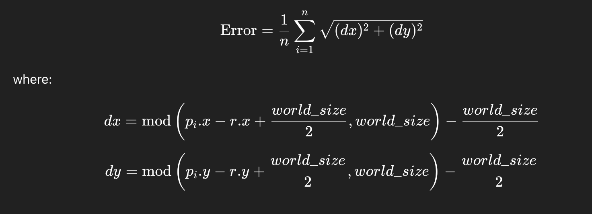

```cpp
double evaluation(Robot r, Robot p[], int n)
{
    //Calculate the mean error of the system
    double sum = 0.0;
    for (int i = 0; i < n; i++) {
        //the second part is because of world's cyclicity
        double dx = mod((p[i].x - r.x + (world_size / 2.0)), world_size) - (world_size / 2.0);
        double dy = mod((p[i].y - r.y + (world_size / 2.0)), world_size) - (world_size / 2.0);
        double err = sqrt(pow(dx, 2) + pow(dy, 2));
        sum += err;
    }
    return sum / n;
}

int main()
{
    //Practice Interfacing with Robot Class
    Robot myrobot;
    myrobot.set_noise(5.0, 0.1, 5.0);
    myrobot.set(30.0, 50.0, M_PI / 2.0);
    myrobot.move(-M_PI / 2.0, 15.0);
    //cout << myrobot.read_sensors() << endl;
    myrobot.move(-M_PI / 2.0, 10.0);
    //cout << myrobot.read_sensors() << endl;

    // Create a set of particles
    int n = 1000;
    Robot p[n];

    for (int i = 0; i < n; i++) {
        p[i].set_noise(0.05, 0.05, 5.0);
        //cout << p[i].show_pose() << endl;
    }

    //Re-initialize myrobot object and Initialize a measurment vector
    myrobot = Robot();
     vector<double> z;

    //Iterating 50 times over the set of particles
    int steps = 50;
    for (int t = 0; t < steps; t++) {

        //Move the robot and sense the environment afterwards
        myrobot = myrobot.move(0.1, 5.0);
        z = myrobot.sense();

        // Simulate a robot motion for each of these particles
        Robot p2[n];
        for (int i = 0; i < n; i++) {
            p2[i] = p[i].move(0.1, 5.0);
            p[i] = p2[i];
        }

        //Generate particle weights depending on robot's measurement
        double w[n];
        for (int i = 0; i < n; i++) {
            w[i] = p[i].measurement_prob(z);
            //cout << w[i] << endl;
        }

        //Resample the particles with a sample probability proportional to the importance weight
        Robot p3[n];
        int index = gen_real_random() * n;
        //cout << index << endl;
        double beta = 0.0;
        double mw = max(w, n);
        //cout << mw;
        for (int i = 0; i < n; i++) {
            beta += gen_real_random() * 2.0 * mw;
            while (beta > w[index]) {
                beta -= w[index];
                index = mod((index + 1), n);
            }
            p3[i] = p[index];
        }
        for (int k=0; k < n; k++) {
            p[k] = p3[k];
            //cout << p[k].show_pose() << endl;
        }

        //####   DON'T MODIFY ANYTHING ABOVE HERE! ENTER CODE BELOW ####
  
        //Evaluate the error by priting it in this form:
        // cout << "Step = " << t << ", Evaluation = " << ErrorValue << endl;
        cout << "Step = " << t << ", Evaluation = " << evaluation(myrobot, p, n) << endl;

    } //End of Steps loop
    return 0;
}
```

**Typical Behavior:**

* Initially, the **average error** is **large** because particles are spread randomly.
* As the algorithm iterates and  **resamples**, the error **decreases** significantly.
* Eventually, the average error  **stabilizes below 1 meter**, indicating  **good localization**

## **Lesson 6: Localization Project (Where am I ?)**

### **6.1 Localization: Parameters**

This part introduces the key parameters for tuning the `amcl` node in the `amcl.launch` file, to improve localization performance.

Key points discussed include:

#### **Overall Filter Parameters**

* **min_particles** and  **max_particles** :

  Set the range for the number of particles AMCL uses.

  * Higher max → more accuracy, more computation.
  * Lower max → faster but potentially less robust.

    Recommended: Tune based on system capabilities.
* **initial_pose** :

  Set the robot's initial pose.
* For the project, set [x,y]=[0,0][x, y] = [0, 0]**[**x**,**y**]**=**[**0**,**0**]**.
* Optionally adjust the yaw (orientation angle).
* **update_min_d** and  **update_min_a** :

  Control when AMCL updates based on movement:

  * Lower values: frequent updates (better tracking, more CPU).
  * Higher values: fewer updates (saves CPU, might miss movements).

#### **Laser Model Parameters**

* **Likelihood Field Model** (Recommended):

  Efficient and reliable for indoor maps like this project.
* **laser_max_beams** :

  Number of beams considered per scan.
* Higher → more accuracy.
* Lower → less computational load.
* **laser_max_range** and  **laser_min_range** :

  Set range limits for valid laser scan data.
* **laser_z_hit** and  **laser_z_rand** :

  Model how confident the laser scanner is about hits (obstacles) vs. random readings.

 **Tuning Tip** :

Align laser scan readings with the map in RViz.

Experiment with these values to improve matching.

#### **Odometry Model Parameters**

* **odom_model_type** :

  Set to `diff-corrected` for differential drive robots.
* **odom_alpha1** to  **odom_alpha4** :

  Represent motion noise in odometry data.

  * For this project, Gazebo provides almost perfect odometry.
  * **Tuning odom noise is optional** — defaults are acceptable.

#### **Summary Table**

| Category       | Key Parameters                                                                         | Notes                                                   |
| -------------- | -------------------------------------------------------------------------------------- | ------------------------------------------------------- |
| Overall Filter | `min_particles`,`max_particles`,`initial_pose`,`update_min_d`,`update_min_a` | Set particle range, initial pose, and update frequency. |
| Laser          | `laser_max_beams`,`laser_max_range`,`laser_z_hit`,`laser_z_rand`               | Tune scan matching accuracy.                            |
| Odometry       | `odom_model_type`,`odom_alpha*`                                                    | Use `diff-corrected`; odometry noise tuning optional. |

#### **Important Notes**

* Start tuning with:
  * `min_particles`, `max_particles`
  * `update_min_d`, `update_min_a`
  * `laser_max_beams`, `laser_z_hit`, `laser_z_rand`
* Always verify results visually in  **RViz**
* Expect iterative improvements through experimentation.
